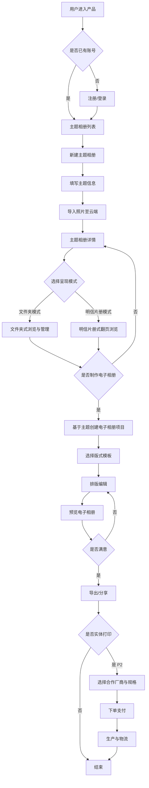
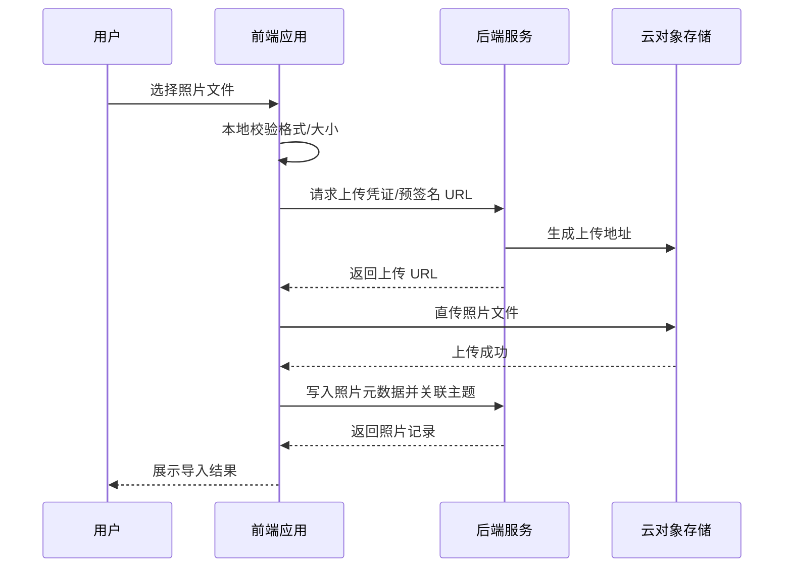

# 主题相册产品 PRD

## 文档信息

| 项目 | 内容 |
|------|------|
| 文档状态 | 第二版（V2.1） |
| 产品代号 | 主题相册（暂定） |
| 目标阶段 | 可交互原型（Prototype） |
| 撰写人 | 产品 |
| 来源 | 市场部口语需求整理 |

> **同步说明**：`PRD.md` 为唯一编辑源。修改后请运行 `npm run sync-prd` 同步生成 `PRD.html`。

## 修订记录

| 版本 | 修订时间（北京时间） | 修订人 | 修订摘要 |
|------|----------------------|--------|----------|
| V1.0 | 2026-08-14 10:30 | 产品 | **初版生成**：基于市场部口语需求，完成价值主张、用户故事、功能清单（P0/P1/P2）、核心流程图、数据字段、异常场景及待澄清项的基础整理。 |
| V2.0 | 2026-08-14 13:47 | 产品 | **补全修订记录**（此前版本未落盘修订历史，本次一并补齐）；细化双模式收纳（文件夹 / 明信片册）的产品定义；明确「收纳」与「电子相册编辑」两条能力线及阶段边界；补充原型阶段云存储与部署约束；完善 Mermaid 流程图、数据字段表与异常场景；扩展待澄清项至 8 条。 |
| V2.1 | 2026-08-14 13:52 | 产品 | 整理标题层级；新增「文档信息」章节；功能清单子节改为 3.1–3.3 编号；新增 `PRD.html` 双栏目录预览页及 `npm run sync-prd` 同步脚本。 |

## 1. 一句话价值主张

**以「主题」为单位收纳与管理照片，支持文件夹与明信片册两种呈现方式，并可在同一产品内完成电子相册排版设计，未来可一键对接合作厂商实现实体打印。**

## 2. 用户故事

### 2.1 普通用户（照片收纳）

| 编号 | 用户故事 |
|------|----------|
| US-01 | **作为**一名希望整理旅行照片的用户，**我希望**按「主题」（如「2025 京都之旅」）创建相册并导入照片，**以便**同类照片集中存放、随时回看，而不是散落在手机相册里。 |
| US-02 | **作为**喜欢明信片风格的用户，**我希望**将某个主题的相册切换为「明信片收纳册」展示模式，**以便**以更有仪式感的形式浏览与收藏照片。 |
| US-03 | **作为**担心本地空间不足的用户，**我希望**照片上传后保存在云端相册中，**以便**不占用本机存储，且换设备后仍能访问历史照片。 |

### 2.2 创作者用户（电子相册设计）

| 编号 | 用户故事 |
|------|----------|
| US-04 | **作为**想制作纪念册的用户，**我希望**在已收纳的主题照片基础上进入「电子相册编辑」，选择版式并排版，**以便**生成可分享的电子相册作品。 |
| US-05 | **作为**对排版没有专业基础的用户，**我希望**系统提供预设模板与拖拽式编辑能力，**以便**快速完成一本主题电子相册，而不必使用复杂设计软件。 |

### 2.3 潜在付费 / 打印用户

| 编号 | 用户故事 |
|------|----------|
| US-06 | **作为**希望将数字作品实体化的用户，**我希望**在电子相册完成后选择合作厂商并下单打印，**以便**收到实体相册或明信片，作为礼物或纪念。 |

### 2.4 运营 / 产品（原型阶段）

| 编号 | 用户故事 |
|------|----------|
| US-07 | **作为**产品验证者，**我希望**在无需完整生产部署的前提下完成可演示原型，**以便**向内部或合作方展示核心体验与商业模式可行性。 |

## 3. 功能清单

### 3.1 P0 — 原型必须实现（验证核心价值）

| 功能 | 说明 |
|------|------|
| 主题相册创建 | 用户以「主题」为单位新建相册，填写主题名称、封面、可选描述。 |
| 照片导入与展示 | 支持从本地上传导入照片，在主题相册内以网格/列表方式浏览。 |
| 文件夹收纳模式 | 默认以「文件夹式」组织：主题 → 照片，结构清晰，便于管理。 |
| 明信片收纳册模式 | 同一主题相册可切换为明信片册式 UI（翻页/卡片叠放等视觉），仅改变呈现，不改变底层数据。 |
| 模式切换 | 用户在文件夹模式与明信片模式间一键切换，状态与主题绑定。 |
| 云端照片存储（原型级） | 照片上传至云存储（可租用第三方对象存储），原型阶段控制单用户容量上限与总存储配额。 |
| 主题列表与详情 | 展示用户全部主题相册，进入后可查看该主题下全部照片。 |

### 3.2 P1 — 原型增强 / MVP 扩展（验证第二曲线）

| 功能 | 说明 |
|------|------|
| 电子相册创建 | 基于某一主题相册的照片，新建「电子相册」项目。 |
| 版式模板 | 提供若干预设页模板（封面、单图、多图、文字页等）。 |
| 基础排版编辑 | 拖拽调整图片位置、替换照片、编辑标题/说明文字。 |
| 电子相册预览 | 翻页预览成品效果，支持全屏演示。 |
| 电子相册导出/分享 | 导出为 PDF 或生成只读分享链接（原型可先实现其一）。 |
| 用户账号体系 | 注册/登录，保证主题与照片跨会话、跨设备归属同一用户。 |

### 3.3 P2 — 远期能力（本期原型不实现，仅规划）

| 功能 | 说明 |
|------|------|
| 合作厂商打印对接 | 与印刷厂商 API 对接，用户从电子相册一键下单实体印刷（相册本、明信片等）。 |
| 订单与物流 | 下单、支付、生产状态、物流跟踪。 |
| 高级设计能力 | 更多模板、自定义字体、品牌贴纸、动效页等。 |
| 协作与共创 | 多人共建同一主题相册或共同编辑电子相册。 |
| 智能辅助 | AI 选图、自动排版、按时间线生成初稿等。 |
| 存储套餐与商业化 | 免费额度 + 付费扩容；打印分成等商业模式。 |

## 4. 核心流程图

### 4.1 主流程：从收纳到（远期）打印

### 4.2 照片导入与云存储流程（P0）

## 5. 关键数据字段定义

### 5.1 用户（User）

| 字段名 | 类型 | 必填 | 说明 |
|--------|------|------|------|
| user_id | string | 是 | 用户唯一标识 |
| nickname | string | 否 | 昵称 |
| email / phone | string | 是（其一） | 登录账号 |
| avatar_url | string | 否 | 头像地址 |
| storage_used_bytes | number | 是 | 已用云存储容量（字节） |
| storage_quota_bytes | number | 是 | 存储配额上限（原型可设固定值） |
| created_at | datetime | 是 | 注册时间 |
| updated_at | datetime | 是 | 更新时间 |

### 5.2 主题相册（ThemeAlbum）

| 字段名 | 类型 | 必填 | 说明 |
|--------|------|------|------|
| album_id | string | 是 | 主题相册唯一标识 |
| user_id | string | 是 | 所属用户 |
| title | string | 是 | 主题名称，如「2025 京都之旅」 |
| description | string | 否 | 主题描述 |
| cover_photo_id | string | 否 | 封面照片 ID |
| display_mode | enum | 是 | `folder`（文件夹）\| `postcard`（明信片册） |
| photo_count | number | 是 | 照片数量（可冗余统计） |
| created_at | datetime | 是 | 创建时间 |
| updated_at | datetime | 是 | 更新时间 |

### 5.3 照片（Photo）

| 字段名 | 类型 | 必填 | 说明 |
|--------|------|------|------|
| photo_id | string | 是 | 照片唯一标识 |
| album_id | string | 是 | 所属主题相册 |
| user_id | string | 是 | 所属用户 |
| file_name | string | 是 | 原始文件名 |
| mime_type | string | 是 | 如 image/jpeg、image/png |
| file_size_bytes | number | 是 | 文件大小 |
| width | number | 否 | 图片宽度（像素） |
| height | number | 否 | 图片高度（像素） |
| storage_url | string | 是 | 云存储访问地址（或 key） |
| thumbnail_url | string | 否 | 缩略图地址 |
| taken_at | datetime | 否 | 拍摄时间（EXIF 解析） |
| sort_order | number | 否 | 相册内排序 |
| created_at | datetime | 是 | 导入时间 |

### 5.4 电子相册（DigitalAlbum）— P1

| 字段名 | 类型 | 必填 | 说明 |
|--------|------|------|------|
| digital_album_id | string | 是 | 电子相册项目 ID |
| source_album_id | string | 是 | 来源主题相册 ID |
| user_id | string | 是 | 所属用户 |
| title | string | 是 | 电子相册标题 |
| template_id | string | 否 | 使用的模板套件 |
| pages | json | 是 | 页面结构与排版数据 |
| status | enum | 是 | `draft` \| `published` |
| share_url | string | 否 | 分享链接 |
| export_url | string | 否 | 导出文件地址 |
| created_at | datetime | 是 | 创建时间 |
| updated_at | datetime | 是 | 更新时间 |

### 5.5 打印订单（PrintOrder）— P2 规划

| 字段名 | 类型 | 必填 | 说明 |
|--------|------|------|------|
| order_id | string | 是 | 订单 ID |
| digital_album_id | string | 是 | 关联电子相册 |
| vendor_id | string | 是 | 合作厂商 |
| product_spec | json | 是 | 规格（尺寸、材质、页数等） |
| amount | number | 是 | 订单金额 |
| status | enum | 是 | `pending` \| `paid` \| `producing` \| `shipped` \| `completed` \| `cancelled` |
| shipping_address | json | 是 | 收货地址 |
| created_at | datetime | 是 | 下单时间 |

## 6. 异常场景与边界条件

### 6.1 照片导入

| 场景 | 处理策略 |
|------|----------|
| 单张文件超过大小上限 | 前端拦截并提示；建议上限原型阶段 10–20MB/张 |
| 不支持格式（如 HEIC 未转码） | 提示仅支持 JPG/PNG/WebP；或后端自动转码（P1） |
| 上传中断 / 网络失败 | 支持重试；已上传部分不重复计费存储（按 photo_id 去重） |
| 存储配额已满 | 阻止上传，提示清理照片或（远期）升级容量 |
| 单次批量导入数量过多 | 限制单次最多 N 张（如 50），超出分批导入 |

### 6.2 模式切换

| 场景 | 处理策略 |
|------|----------|
| 主题内无照片时切换明信片模式 | 允许切换，展示空状态引导上传 |
| 切换模式是否影响电子相册 | 不影响；电子相册引用照片源数据，与展示模式解耦 |
| 明信片模式照片过多 | 分页或懒加载，避免一次渲染过多 DOM |

### 6.3 电子相册编辑（P1）

| 场景 | 处理策略 |
|------|----------|
| 源主题照片被删除 | 编辑页标记缺失位，提示替换图片 |
| 未保存离开编辑页 | 弹窗确认是否保存草稿 |
| 并发生成导出任务 | 队列处理，避免重复导出 |

### 6.4 云存储与数据安全

| 场景 | 处理策略 |
|------|----------|
| 云存储服务不可用 | 上传失败提示，记录错误日志；只读场景可展示缓存缩略图 |
| 数据损坏 / 丢失 | 依赖云厂商冗余；关键元数据 DB 与 OSS 分离备份（生产要求） |
| 用户注销账号 | 按合规要求删除或匿名化用户数据及 OSS 对象 |

### 6.5 原型阶段特有限制

| 场景 | 处理策略 |
|------|----------|
| 无正式生产部署环境 | 使用演示环境 / 临时域名；明确标注「原型」 |
| 云存储成本可控 | 单用户配额、总容量上限、定期清理测试数据 |
| 打印能力未接入 | P2 功能入口可灰显或展示「即将上线」占位 |

## 7. 待进一步澄清的问题

| 编号 | 问题 | 影响范围 | 建议澄清方 |
|------|------|----------|------------|
| Q1 | **目标用户是谁？** C 端个人用户、家庭用户，还是 B 端（婚庆、旅行社、设计师）？ | 功能深度、模板风格、商业模式 | 市场部 + 业务负责人 |
| Q2 | **「主题」如何定义？** 用户手动创建，还是支持按时间/地点/事件自动聚类？ | 相册创建流程、智能能力优先级 | 产品 + 市场部 |
| Q3 | **明信片收纳册的具体交互是什么？** 翻页动画、卡片堆叠、还是拟物相册本？是否有参考产品？ | UI/UX 设计、开发工作量 | 市场部 + 设计 |
| Q4 | **文件夹模式与明信片模式是否互斥？** 同一主题是否只能二选一，还是仅切换视图？（当前 PRD 按「视图切换」理解） | 数据模型、用户心智 | 产品 |
| Q5 | **电子相册与主题相册的关系？** 一个主题是否只能生成一本电子相册，还是可生成多版本？ | 数据结构与列表页设计 | 产品 |
| Q6 | **打印合作厂商是否已有意向？** 对接 API、SKU、计价、发货谁负责？ | P2 排期与接口设计 | 商务 + 市场部 |
| Q7 | **原型部署形态？** Web、小程序、还是 App？演示环境域名与访问范围？ | 技术选型、云存储方案 | 研发 + 运维 |
| Q8 | **云存储预算与合规？** 国内/海外节点、用户隐私与图片版权归属、免费额度策略？ | 成本模型、上线合规 | 研发 + 法务 |

## 附录：需求来源摘要（口语还原）

市场部同事核心表达：

1. 产品兼具 **照片收纳** 与 **电子相册编辑排版** 两大能力。  
2. 收纳侧支持两种模式：**文件夹式** 与 **明信片收纳册式**（个人偏好后者）。  
3. 以 **主题** 为单位沉淀全部相关照片。  
4. 远期可与 **印刷厂商合作**，用户完成链接/作品后可直接下单打印。  
5. 必须使用 **云端存储** 照片，本地方案空间与成本不可持续，且存在数据损耗风险。  
6. 当前阶段以 **原型** 为主：部署环境未定，云存储成本需在原型中做限额与验证。

*文档结束*
