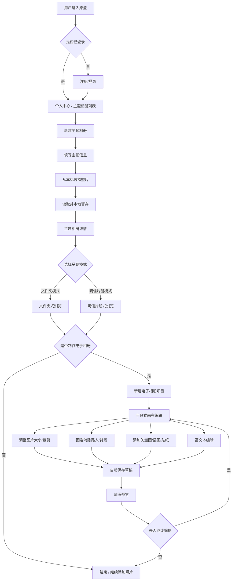
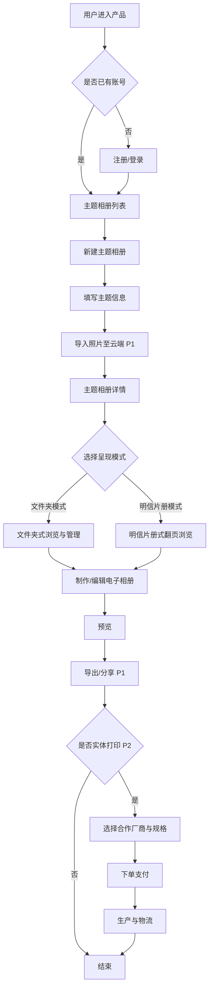
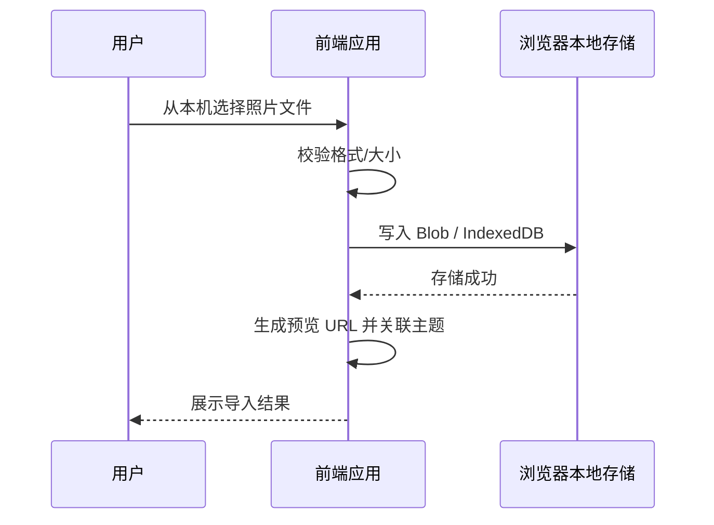
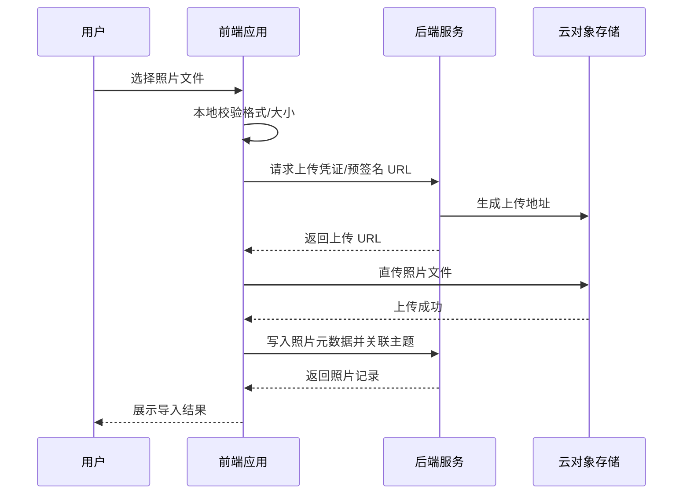

# 主题相册产品 PRD

## 文档信息

| 项目 | 内容 |
|------|------|
| 文档状态 | 第二版（V2.3） |
| 产品代号 | 主题相册（暂定） |
| 目标阶段 | 可交互原型（Prototype） |
| 撰写人 | 产品 |
| 来源 | 市场部口语需求整理 |

> **同步说明**：`PRD.md` 为唯一编辑源。修改后请运行 `npm run sync-prd` 同步生成 `PRD.html`。

## 修订记录

| 版本 | 修订时间（北京时间） | 修订人 | 修订摘要 |
|------|----------------------|--------|----------|
| V1.0 | 2026-08-14 10:30 | 产品 | **初版生成**：基于市场部口语需求，完成价值主张、用户故事、功能清单（P0/P1/P2）、核心流程图、数据字段、异常场景及待澄清项的基础整理。 |
| V2.0 | 2026-08-14 13:47 | 产品 | **补全修订记录**（此前版本未落盘修订历史，本次一并补齐）；细化双模式收纳（文件夹 / 明信片册）的产品定义；明确「收纳」与「电子相册编辑」两条能力线及阶段边界；补充原型阶段云存储与部署约束；完善 Mermaid 流程图、数据字段表与异常场景；扩展待澄清项至 8 条。 |
| V2.1 | 2026-08-14 13:52 | 产品 | 整理标题层级；新增「文档信息」章节；功能清单子节改为 3.1–3.3 编号；新增 `PRD.html` 双栏目录预览页及 `npm run sync-prd` 同步脚本。 |
| V2.2 | 2026-08-14 14:02 | 产品 | 根据思维导图补充目标用户画像（年轻人 / 老年人）及共性需求；明确本期原型仅支持本地上传照片，电子相册制作、云存储等能力下调至 P1/P2 远期规划；同步更新功能清单、流程图、数据字段与异常场景。 |
| V2.3 | 2026-08-14 14:10 | 产品 | **修正原型范围**：本期不含云存储，但包含基本账号/个人中心，以及完整电子相册编辑美化能力（手账式排版、图片编辑、素材装饰、文本编辑）；云存储、导出分享、打印仍属 P1/P2。 |

## 1. 一句话价值主张

**以「主题」为单位收纳与管理照片，在本地上传基础上提供手账式电子相册编辑美化能力（图片自由排版、智能抠图、素材装饰、富文本），并支持基本账号与个人中心。远期对接云存储与实体打印。本期原型聚焦「本地上传 + 账号 + 电子相册编辑」核心体验验证。**

## 2. 目标用户与需求

### 2.1 核心需求（产品愿景）

| 需求方向 | 说明 |
|----------|------|
| 照片收纳 | 以主题为单元整理、浏览与管理照片，支持文件夹式与明信片册式两种呈现。 |
| 电子相册制作 | 在已收纳照片基础上进行美观排版，**交互参考电子手账软件**，支持图片自由编辑、素材装饰与富文本，视觉风格可参考 Zine（独立杂志）。 |

> 本期原型实现：**本地上传照片收纳** + **基本账号/个人中心** + **电子相册编辑美化**；**不含云存储**（照片与作品数据暂存本地/服务端非 OSS 方案，待 P1 接入云端）。

### 2.2 目标用户画像

#### 共性特征

| 维度 | 描述 |
|------|------|
| 时间场景 | 用户**无法空出大量整块时间**，希望在通勤、等待等**碎片时间**也能完成相册相关操作。 |
| 操作预期 | **操作便捷、快速上手**，降低学习成本，减少复杂步骤。 |

#### 年轻人

| 维度 | 描述 |
|------|------|
| 核心诉求 | 追求**时尚潮流感**的定制 Zine，希望作品有设计感、可分享、能表达个性。 |
| 产品侧重 | 丰富模板、潮流版式、高自由度手账式排版；明信片册模式可作为核心展示形态之一。 |

#### 老年人

| 维度 | 描述 |
|------|------|
| 核心诉求 | **简单上手**，能轻松完成「美化相册」，不需要专业设计知识。 |
| 产品侧重 | 大字号、步骤少、默认模板一键生成；文件夹模式降低认知负担。 |

### 2.3 用户故事

#### 2.3.1 本期原型（P0）

| 编号 | 用户故事 |
|------|----------|
| US-01 | **作为**一名希望整理旅行照片的用户，**我希望**按「主题」创建相册并从本地上传照片，**以便**同类照片集中存放、随时回看。 |
| US-02 | **作为**喜欢明信片风格的用户，**我希望**将某个主题的相册切换为「明信片收纳册」展示模式，**以便**以更有仪式感的形式浏览与收藏照片。 |
| US-03 | **作为**注册用户，**我希望**拥有基本账号与个人中心（头像、昵称等），**以便**管理我的主题相册与电子相册作品。 |
| US-04 | **作为**时间碎片化的年轻用户，**我希望**像使用电子手账一样自由排版照片与素材，**以便**在碎片时间持续编辑一本电子相册。 |
| US-05 | **作为**追求作品质感的用户，**我希望**自由调整图片大小、裁剪局部，并圈选画面主体以消除路人和背景，**以便**让内页更干净、更突出主体。 |
| US-06 | **作为**注重装饰效果的用户，**我希望**使用平台内置的矢量图、插画和小贴纸装点内页，**以便**让电子相册更有个性。 |
| US-07 | **作为**需要记录文字的用户，**我希望**添加并编辑文本（字体、大小、粗细、花体、下划线、删除线、颜色等），**以便**为相册配上标题、说明与心情记录。 |
| US-08 | **作为**老年用户，**我希望**通过简单几步选择模板并拖拽排版，**以便**轻松「美化相册」而无需学习复杂操作。 |

#### 2.3.2 远期用户（P1/P2）

| 编号 | 用户故事 |
|------|----------|
| US-09 | **作为**担心本地空间不足的用户，**我希望**照片与作品保存在云端，**以便**不占用本机存储，且换设备后仍能访问（P1）。 |
| US-10 | **作为**希望分享作品的用户，**我希望**导出 PDF 或生成分享链接，**以便**将电子相册发给亲友（P1）。 |
| US-11 | **作为**希望将数字作品实体化的用户，**我希望**在电子相册完成后选择合作厂商并下单打印，**以便**收到实体相册或明信片（P2）。 |

## 3. 功能清单

### 3.1 P0 — 本期原型

#### 3.1.1 账号与个人中心

| 功能 | 说明 |
|------|------|
| 注册 / 登录 | 支持手机号或邮箱注册登录（原型可采用简化鉴权）。 |
| 个人中心 | 展示与编辑基本信息：头像、昵称、账号 ID 等。 |
| 我的作品入口 | 个人中心可查看「我的主题相册」「我的电子相册」列表。 |

#### 3.1.2 照片收纳（本地上传，不含云存储）

| 功能 | 说明 |
|------|------|
| 主题相册创建 | 用户以「主题」为单位新建相册，填写主题名称、封面、可选描述。 |
| 本地上传照片 | **仅支持从本机选择并读取照片**，不上传至云 OSS；照片暂存于浏览器本地（IndexedDB / Blob）或服务端临时存储。 |
| 照片展示 | 在主题相册内以网格/列表方式浏览已导入照片。 |
| 文件夹收纳模式 | 默认以「文件夹式」组织：主题 → 照片。 |
| 明信片收纳册模式 | 同一主题相册可切换为明信片册式 UI，仅改变呈现。 |
| 模式切换 | 文件夹模式与明信片模式一键切换。 |
| 主题列表与详情 | 展示全部主题相册及照片详情。 |

#### 3.1.3 电子相册编辑美化（手账式，参考电子手账软件）

| 功能 | 说明 |
|------|------|
| 电子相册创建 | 基于某一主题相册照片，新建「电子相册」项目，支持多页画布。 |
| 画布自由排版 | 类手账/电子手账交互：拖拽、缩放、旋转、层级调整（置顶/置底）。 |
| 图片大小调整 | 用户可自由拉伸、缩放图片元素，保持或打破宽高比（可配置）。 |
| 图片裁剪 | 支持框选裁剪，保留画面局部区域。 |
| 智能圈选与消除 | 用户可圈选/涂抹画面中的关键物体或区域，**消除路人、杂物及背景**（原型可采用 AI 抠图 / inpainting 能力或简化实现）。 |
| 内置素材库 | 平台提供**矢量图、插画、小贴纸**等装饰素材，可拖拽至内页任意位置。 |
| 文本编辑 | 支持添加文本框，并提供常见富文本能力：**字体选择、字号、粗细、斜体/花体、下划线、删除线、字体颜色**等。 |
| 页面管理 | 新增/删除/复制/排序内页；支持碎片时间分次编辑。 |
| 自动保存草稿 | 编辑过程自动保存，防止意外丢失。 |
| 电子相册预览 | 翻页预览成品效果，支持全屏演示。 |

**本期原型明确不做：** 云存储（OSS）、跨设备云端同步、导出分享、打印对接。

### 3.2 P1 — MVP 扩展（云能力与分发）

| 功能 | 说明 |
|------|------|
| 云端照片与作品存储 | 照片及电子相册项目上传至云存储，解决本地空间不足与跨设备同步。 |
| 电子相册导出/分享 | 导出为 PDF 或生成只读分享链接。 |
| 老年人友好模式 | 简化操作流程：大字号、步骤引导、默认模板一键生成。 |
| 更多模板与素材 | 扩充 Zine / 手账风格页模板与素材包。 |

### 3.3 P2 — 远期能力（商业化与深度能力）

| 功能 | 说明 |
|------|------|
| 合作厂商打印对接 | 与印刷厂商 API 对接，用户从电子相册一键下单实体印刷（相册本、明信片等）。 |
| 订单与物流 | 下单、支付、生产状态、物流跟踪。 |
| 高级设计能力 | 更多潮流模板、自定义字体、品牌贴纸、动效页等。 |
| 协作与共创 | 多人共建同一主题相册或共同编辑电子相册。 |
| 智能辅助 | AI 选图、自动排版、按时间线生成初稿等。 |
| 存储套餐与商业化 | 免费额度 + 付费扩容；打印分成等商业模式。 |

## 4. 核心流程图

### 4.1 本期原型主流程（P0）

### 4.2 远期主流程（P1/P2：云同步 → 分享 → 打印）

### 4.3 本期原型：本地上传照片流程（P0）

### 4.4 远期：照片导入与云存储流程（P1）

## 5. 关键数据字段定义

> 以下字段按产品全量愿景定义。标有阶段标注的字段在对应阶段才需要实现。

### 5.1 用户（User）— P0

| 字段名 | 类型 | 必填 | 说明 |
|--------|------|------|------|
| user_id | string | 是 | 用户唯一标识 |
| nickname | string | 否 | 昵称 |
| email / phone | string | 是（其一） | 登录账号 |
| avatar_url | string | 否 | 头像地址 |
| storage_used_bytes | number | 否 | 已用云存储容量（P1 起启用） |
| storage_quota_bytes | number | 否 | 存储配额上限（P1 起启用） |
| created_at | datetime | 是 | 注册时间 |
| updated_at | datetime | 是 | 更新时间 |

### 5.2 主题相册（ThemeAlbum）— P0

| 字段名 | 类型 | 必填 | 说明 |
|--------|------|------|------|
| album_id | string | 是 | 主题相册唯一标识 |
| user_id | string | 是 | 所属用户 |
| title | string | 是 | 主题名称，如「2025 京都之旅」 |
| description | string | 否 | 主题描述 |
| cover_photo_id | string | 否 | 封面照片 ID |
| display_mode | enum | 是 | `folder`（文件夹）\| `postcard`（明信片册） |
| photo_count | number | 是 | 照片数量（可冗余统计） |
| created_at | datetime | 是 | 创建时间 |
| updated_at | datetime | 是 | 更新时间 |

### 5.3 照片（Photo）— P0

| 字段名 | 类型 | 必填 | 说明 |
|--------|------|------|------|
| photo_id | string | 是 | 照片唯一标识 |
| album_id | string | 是 | 所属主题相册 |
| user_id | string | 是 | 所属用户 |
| file_name | string | 是 | 原始文件名 |
| mime_type | string | 是 | 如 image/jpeg、image/png |
| file_size_bytes | number | 是 | 文件大小 |
| width | number | 否 | 图片宽度（像素） |
| height | number | 否 | 图片高度（像素） |
| local_blob_key | string | 是（P0） | 浏览器本地存储键（IndexedDB key 或 Blob 引用） |
| storage_url | string | 是（P1） | 云存储访问地址（P1 起替代本地存储） |
| thumbnail_url | string | 否 | 缩略图地址 |
| taken_at | datetime | 否 | 拍摄时间（EXIF 解析） |
| sort_order | number | 否 | 相册内排序 |
| created_at | datetime | 是 | 导入时间 |

### 5.4 电子相册（DigitalAlbum）— P0

| 字段名 | 类型 | 必填 | 说明 |
|--------|------|------|------|
| digital_album_id | string | 是 | 电子相册项目 ID |
| source_album_id | string | 是 | 来源主题相册 ID |
| user_id | string | 是 | 所属用户 |
| title | string | 是 | 电子相册标题 |
| style | enum | 否 | 风格标签，如 `zine`、`journal`（手账） |
| pages | json | 是 | 页面列表，每页包含画布元素（见 5.5） |
| status | enum | 是 | `draft` \| `preview_ready` |
| created_at | datetime | 是 | 创建时间 |
| updated_at | datetime | 是 | 更新时间 |

### 5.5 画布元素（CanvasElement）— P0

| 字段名 | 类型 | 必填 | 说明 |
|--------|------|------|------|
| element_id | string | 是 | 元素唯一标识 |
| page_id | string | 是 | 所属内页 ID |
| type | enum | 是 | `image` \| `text` \| `sticker` \| `vector` \| `illustration` |
| transform | json | 是 | 位置 (x,y)、缩放、旋转、层级 z-index |
| image_edit | json | 否 | 图片专属：裁剪区域、抠图/消除蒙版、原图引用 |
| text_style | json | 否 | 文本专属：内容、字体、字号、粗细、斜体、下划线、删除线、颜色 |
| asset_id | string | 否 | 素材库资源 ID（贴纸/矢量图/插画） |
| photo_id | string | 否 | 引用的主题相册照片 ID |

### 5.6 素材资源（Asset）— P0

| 字段名 | 类型 | 必填 | 说明 |
|--------|------|------|------|
| asset_id | string | 是 | 素材唯一标识 |
| type | enum | 是 | `vector` \| `illustration` \| `sticker` |
| name | string | 是 | 素材名称 |
| file_url | string | 是 | 素材文件地址（SVG/PNG 等） |
| tags | array | 否 | 分类标签，便于检索 |
| is_builtin | boolean | 是 | 是否为平台内置素材 |

### 5.7 打印订单（PrintOrder）— P2 规划

| 字段名 | 类型 | 必填 | 说明 |
|--------|------|------|------|
| order_id | string | 是 | 订单 ID |
| digital_album_id | string | 是 | 关联电子相册 |
| vendor_id | string | 是 | 合作厂商 |
| product_spec | json | 是 | 规格（尺寸、材质、页数等） |
| amount | number | 是 | 订单金额 |
| status | enum | 是 | `pending` \| `paid` \| `producing` \| `shipped` \| `completed` \| `cancelled` |
| shipping_address | json | 是 | 收货地址 |
| created_at | datetime | 是 | 下单时间 |

## 6. 异常场景与边界条件

### 6.1 照片导入（P0：本地上传）

| 场景 | 处理策略 |
|------|----------|
| 单张文件超过大小上限 | 前端拦截并提示；建议上限原型阶段 10–20MB/张 |
| 不支持格式（如 HEIC 未转码） | 提示仅支持 JPG/PNG/WebP |
| 浏览器本地存储配额不足 | 提示用户清理已导入照片或缩减导入数量 |
| 单次批量导入数量过多 | 限制单次最多 N 张（如 50），超出分批导入 |
| 刷新页面后数据丢失 | P0 使用 IndexedDB 持久化；若用户清除浏览器数据则照片不可恢复，需提示 |

### 6.2 模式切换

| 场景 | 处理策略 |
|------|----------|
| 主题内无照片时切换明信片模式 | 允许切换，展示空状态引导上传 |
| 切换模式是否影响电子相册 | 不影响；电子相册引用照片源数据，与展示模式解耦 |
| 明信片模式照片过多 | 分页或懒加载，避免一次渲染过多 DOM |

### 6.3 电子相册编辑（P0）

| 场景 | 处理策略 |
|------|----------|
| 源主题照片被删除 | 编辑页标记缺失位，提示替换图片 |
| 未保存离开编辑页 | 弹窗确认；编辑过程**自动保存草稿**，支持碎片时间分次编辑 |
| 智能消除处理失败或超时 | 提示用户重试或手动裁剪替代；原型可降级为简单抠图 |
| 圈选区域过小或过大 | 给出最小/最大选区提示，引导用户重新圈选 |
| 素材库加载失败 | 展示重试按钮；内置核心贴纸包可做离线缓存 |
| 文本超出画布边界 | 自动换行或提示用户缩小字号/调整文本框 |
| 老年用户操作迷失 | 提供步骤引导与「一键套用模板」兜底路径 |
| 画布元素过多导致卡顿 | 限制单页元素上限；超出时提示拆分页面 |

### 6.4 账号与个人中心（P0）

| 场景 | 处理策略 |
|------|----------|
| 登录态过期 | 引导重新登录；本地草稿暂存，登录后恢复 |
| 头像上传失败 | 保留默认头像并提示重试 |
| 昵称含敏感词 | 前端校验并提示修改 |

### 6.5 云存储与数据安全（P1 起）

| 场景 | 处理策略 |
|------|----------|
| 云存储服务不可用 | 上传失败提示，记录错误日志；只读场景可展示缓存缩略图 |
| 上传中断 / 网络失败 | 支持重试；已上传部分不重复计费存储（按 photo_id 去重） |
| 存储配额已满 | 阻止上传，提示清理照片或升级容量 |
| 数据损坏 / 丢失 | 依赖云厂商冗余；关键元数据 DB 与 OSS 分离备份 |
| 用户注销账号 | 按合规要求删除或匿名化用户数据及 OSS 对象 |

### 6.6 原型阶段特有限制

| 场景 | 处理策略 |
|------|----------|
| 不含云存储 | 照片与作品不做 OSS 云端同步；换设备或清缓存后本地数据可能不可恢复，需提示用户 |
| 无导出分享 | 相关入口不展示或灰显「即将上线」（P1） |
| 无正式生产部署环境 | 使用演示环境 / 临时域名；明确标注「原型」 |
| 打印能力未接入 | P2 功能入口灰显或展示「即将上线」占位 |
| 智能消除能力受限 | 原型阶段可采用第三方 AI API 或简化算法，效果与性能需在演示时管理预期 |

## 7. 待进一步澄清的问题

| 编号 | 问题 | 影响范围 | 建议澄清方 |
|------|------|----------|------------|
| Q1 | **年轻人与老年人的功能差异如何平衡？** 是统一产品两套 UI 主题，还是分模式切换？ | 信息架构、模板设计 | 产品 + 设计 |
| Q2 | **「主题」如何定义？** 用户手动创建，还是支持按时间/地点/事件自动聚类？ | 相册创建流程、智能能力优先级 | 产品 + 市场部 |
| Q3 | **明信片收纳册的具体交互是什么？** 翻页动画、卡片堆叠、还是拟物相册本？是否有参考产品？ | UI/UX 设计、开发工作量 | 市场部 + 设计 |
| Q4 | **智能消除（路人/背景）的技术方案？** 自研模型、第三方 API，还是原型阶段手动抠图兜底？ | 编辑体验、成本、演示效果 | 研发 + 产品 |
| Q5 | **内置素材库的范围？** 首期提供多少矢量图/插画/贴纸？是否分主题包？ | 设计工作量、素材版权 | 设计 + 市场部 |
| Q6 | **文件夹模式与明信片模式是否互斥？** 同一主题是否只能二选一，还是仅切换视图？ | 数据模型、用户心智 | 产品 |
| Q7 | **电子相册与主题相册的关系？** 一个主题是否只能生成一本电子相册，还是可生成多版本？ | 数据结构与列表页设计 | 产品 |
| Q8 | **打印合作厂商是否已有意向？** 对接 API、SKU、计价、发货谁负责？ | P2 排期与接口设计 | 商务 + 市场部 |
| Q9 | **原型部署形态？** Web、小程序、还是 App？演示环境域名与访问范围？ | 技术选型 | 研发 + 运维 |
| Q10 | **P1 云存储预算与合规？** 国内/海外节点、用户隐私与图片版权归属、免费额度策略？ | 成本模型、上线合规 | 研发 + 法务 |

## 附录 A：需求来源摘要（市场部口语）

市场部同事核心表达：

1. 产品兼具 **照片收纳** 与 **电子相册编辑排版** 两大能力。  
2. 收纳侧支持两种模式：**文件夹式** 与 **明信片收纳册式**（个人偏好后者）。  
3. 以 **主题** 为单位沉淀全部相关照片。  
4. 远期可与 **印刷厂商合作**，用户完成作品后可直接下单打印。  
5. 正式产品需使用 **云端存储** 照片；**本期原型不含云存储**，照片本地上传，但包含账号与完整编辑能力。  
6. 当前阶段以 **原型** 为主：验证「收纳 + 手账式编辑美化」完整链路。

## 附录 B：思维导图信息摘要（用户与需求）

来源：市场部思维导图「电子相册」

**需求：**

- 照片收纳
- 电子相册制作（美观，参考 Zine 独立杂志风格）

**用户共性：**

- 无法空出大量整块时间，希望在碎片时间也能制作
- 操作便捷，能快速上手

**适用群体：**

| 群体 | 核心诉求 |
|------|----------|
| 年轻人 | 时尚潮流感强的定制 Zine |
| 老年人 | 简单上手，美化相册 |

*文档结束*
