# 模力通双模式与深度研究任务流 PRD

> [打开双栏独立滚动阅读版](./PRD.html)：左侧为可上下滑动目录，右侧为可上下滑动 PRD 正文。修改正文后请执行 `python3 scripts/sync-prd-html.py` 同步到 HTML 阅读页。

## 目录

- [0. 文档信息](#0-文档信息)
  - [0.1 修订记录](#01-修订记录)
  - [0.2 后续修订规则](#02-后续修订规则)
  - [0.3 index.html 原型迭代记录](#03-indexhtml-原型迭代记录)
- [1. 一句话价值主张](#1-一句话价值主张)
- [2. 背景与目标](#2-背景与目标)
  - [2.1 背景](#21-背景)
  - [2.2 产品目标](#22-产品目标)
  - [2.3 非目标](#23-非目标)
- [3. 模式定义与适用场景](#3-模式定义与适用场景)
  - [3.1 模式推荐规则](#31-模式推荐规则)
  - [3.2 首页三功能入口（写作 / 深度研究 / AI PPT）](#32-首页三功能入口写作--深度研究--ai-ppt)
- [4. 用户故事](#4-用户故事)
- [5. 功能清单](#5-功能清单)
  - [5.1 P0](#51-p0)
  - [5.2 P1](#52-p1)
  - [5.3 P2](#53-p2)
- [6. 核心流程](#6-核心流程)
  - [6.1 智能体助手互动用户流程](#61-智能体助手互动用户流程)
    - [6.1.1 登录与进入智能体助手](#611-登录与进入智能体助手)
    - [6.1.2 首页功能入口与模式 Tag 选择](#612-首页功能入口与模式-tag-选择)
    - [6.1.3 智能体模式与快速/交互模式切换](#613-智能体模式与快速交互模式切换)
    - [6.1.4 快速模式：任务提交至交付](#614-快速模式任务提交至交付)
    - [6.1.5 交互模式：补充信息问卷与多智能体协作](#615-交互模式补充信息问卷与多智能体协作)
    - [6.1.6 写作功能用户使用流程](#616-写作功能用户使用流程)
    - [6.1.7 深度研究功能用户使用流程](#617-深度研究功能用户使用流程)
    - [6.1.8 AI PPT 功能用户使用流程](#618-ai-ppt-功能用户使用流程)
    - [6.1.9 对话页追问与续问](#619-对话页追问与续问)
    - [6.1.10 问答书签导航](#6110-问答书签导航)
    - [6.1.11 历史对话恢复与管理](#6111-历史对话恢复与管理)
    - [6.1.12 文风助手库创建](#6112-文风助手库创建)
    - [6.1.13 AI 内容审校](#6113-ai-内容审校)
- [7. 深度研究任务流及生成规则](#7-深度研究任务流及生成规则)
  - [7.0 办公写作智能体团队](#70-办公写作智能体团队)
  - [7.1 阶段划分](#71-阶段划分)
  - [7.2 任务拆解规则](#72-任务拆解规则)
  - [7.3 状态栏展示规则](#73-状态栏展示规则)
    - [7.3.1 任务流百分比进度条](#731-新增需求任务流百分比进度条)
  - [7.4 子任务状态规则](#74-子任务状态规则)
  - [7.5 负责人展示规则](#75-负责人展示规则)
  - [7.6 阶段结果展示规则](#76-阶段结果展示规则)
- [8. 文风库](#8-文风库)
  - [8.1 预置文风](#81-预置文风)
  - [8.2 文风生效规则](#82-文风生效规则)
- [9. 结果展示方案](#9-结果展示方案)
  - [9.1 推荐结构](#91-推荐结构)
  - [9.2 内容组件](#92-内容组件)
  - [9.3 用户后续操作](#93-用户后续操作)
  - [9.4 “你可能想问”规则](#94-你可能想问规则)
- [10. Web 与桌面端一致性规则](#10-web-与桌面端一致性规则)
- [11. 关键数据字段定义](#11-关键数据字段定义)
- [12. 异常场景与边界条件](#12-异常场景与边界条件)
- [13. 内容质量改进建议](#13-内容质量改进建议)
- [14. 验收标准](#14-验收标准)
- [15. 待澄清问题](#15-待澄清问题)

## 0. 文档信息

| 项目 | 内容 |
| --- | --- |
| 产品名称 | 模力通办公智能体 |
| 需求主题 | 快速模式、交互模式、文风库及深度研究任务流 |
| 文档状态 | Draft |
| 当前版本 | V2.0-r33 |
| 时间标准 | 北京时间（UTC+8） |
| 首版生成时间 | 2026-08-13 10:17（北京时间） |
| 最近修订时间 | 2026-08-13 17:47（北京时间） |
| 目标端 | Web 端、桌面端 |
| 目标读者 | 产品、设计、前端、后端、算法、测试、运营 |

### 0.1 修订记录

> 本表已补录此前缺失的 V1.0 首版记录。所有时间均采用北京时间（UTC+8）；后续每次修改 PRD 时，必须同步更新“当前版本”“最近修订时间”及本修订记录。

| 版本 | 修订时间（北京时间） | 修订类型 | 修改内容摘要 |
| --- | --- | --- | --- |
| V1.0 | 2026-08-13 10:17 | 第一版生成 | 首次整理完整 PRD；定义快速模式与交互模式、用户故事、P0/P1/P2 功能、核心流程、深度研究任务流、文风库、结果展示、跨端一致性、关键字段、异常场景、验收标准及待澄清问题。 |
| V2.0 | 2026-08-13 10:29 | 第二版需求补充 | 将每条主任务、阶段任务和子任务流的可视化追踪及百分比进度条标记为 P0；补充进度展示、加权计算、状态颜色、更新频率、暂停/失败/重试/重规划、无障碍、数据字段、异常场景和验收规则。 |
| V2.0-r1 | 2026-08-13 10:32 | 第二版修订记录补录 | 补录此前缺少的版本历史，明确第一版生成时间、第二版修改时间及对应修改内容，并将整份文档的修订时间统一为北京时间；本次不改变产品需求范围。 |
| V2.0-r2 | 2026-08-13 10:37 | 第二版目录整理 | 统一一级、二级、三级和四级标题层次，在文档顶部新增可点击的多级目录，覆盖全部章节及子章节，便于快速定位；本次不改变产品需求范围。 |
| V2.0-r3 | 2026-08-13 10:43 | 第二版双栏阅读布局 | 新增独立双栏阅读页面：左侧较窄区域展示可独立上下滑动的目录，右侧展示可独立上下滑动的 PRD 正文；目录支持点击定位和当前章节高亮，左右区域均常驻显示滚动条；本次不改变产品需求范围。 |
| V2.0-r4 | 2026-08-13 10:57 | 第二版双栏阅读布局优化 | 优化 `PRD.html` 双栏布局比例与滚动体验：左侧目录区收窄为独立滚动面板，右侧正文区独立滚动；两侧均常驻显示滚动条轨道与滑块，目录与正文滚动互不影响；本次不改变产品需求范围。 |
| V2.0-r5 | 2026-08-13 11:03 | PRD 双栏离线同步 | 修复 `PRD.html` 直接打开时无法加载 `PRD.md` 的问题；新增 `scripts/sync-prd-html.py`，将 `PRD.md` 正文内嵌到 `PRD.html`；约定后续修改 PRD 正文后必须同步更新两个文件；本次不改变产品需求范围。 |
| V2.0-r6 | 2026-08-13 11:14 | PRD 字体与结构优化 | 将 `PRD.html` 正文字体整体放大 2 倍并加宽阅读区域；为多级无序/有序列表增加层次化 bullet 样式；在 PRD 正文中补充多级 bullet 与序号结构，强化章节层级表达；本次不改变产品需求范围。 |
| V2.0-r7 | 2026-08-13 11:28 | PRD 字体缩小 | 将 `PRD.html` 阅读页正文字号、标题字号、目录字号及表格/代码块字号整体缩小至上一版的 65%；本次不改变产品需求范围。 |
| V2.0-r8 | 2026-08-13 11:42 | index.html 迭代记录 | 在文档信息区新增 `0.3 index.html 原型迭代记录`，从首版起逐条补录各版本修改时间与变更摘要；本次不改变产品需求范围。 |
| V2.0-r9 | 2026-08-13 13:52 | 原型任务流内嵌 | 将 AI 智能助手任务流模拟逻辑从 `scripts/workflow-sim.js` 合并至 `index.html` 单文件，便于双击打开即可完成圆形流程测试；本次不改变产品需求范围。 |
| V2.0-r10 | 2026-08-13 14:00 | 原型单脚本整合 | 将任务流模拟与页面交互逻辑合并为 `index.html` 内单一 `<script>`；移除独立沙盒入口与外部脚本依赖，发送需求即在本页进入智能体工作区完成全流程原型测试；本次不改变产品需求范围。 |
| V2.0-r11 | 2026-08-13 14:05 | 对话页任务流原型 | 重构发送需求后的对话页布局：可滚动聊天流、负责人交接、内嵌待办与文档预览，底部固定输入框；按用户需求模拟 docx/pptx 交付；本次不改变产品需求范围。 |
| V2.0-r12 | 2026-08-13 14:12 | 进度条与智能体职责修复 | 同步 `index.html` V1.19：修复最终交付时进度条应为 100% 的逻辑；明确六智能体按职责参与任务拆分与 handoff；本次不改变产品需求范围。 |
| V2.0-r13 | 2026-08-13 14:22 | Logo 返回首页 | 同步 `index.html` V1.20：对话页完成后点击左上角 Logo 返回首页并重置任务流状态；本次不改变产品需求范围。 |
| V2.0-r14 | 2026-08-13 14:29 | 智能体团队职责同步 | 新增 §7.0「办公写作智能体团队」，按首页「您的智能体团队」设计稿同步六类智能体的角色定位、能力标签、核心职责与专业价值；与 §7.1 阶段负责人映射对齐。 |
| V2.0-r15 | 2026-08-13 14:32 | PRD 字体放大 | 将 `PRD.html` 阅读页正文字号、标题字号、目录字号及表格/代码块字号整体放大至上一版的 165%（+65%）；本次不改变产品需求范围。 |
| V2.0-r16 | 2026-08-13 14:48 | 变动等级规则（已撤销） | 曾新增 §0.2 三级变动等级及修订表「变动等级」列；已于 r17 撤销，恢复 r15 版修订规则。 |
| V2.0.1 | 2026-08-13 15:01 | 字体恢复（已并入 r17） | 曾将 `PRD.html` 字号恢复至 r7 水平并修正变动等级规则；变动等级部分已于 r17 撤销。 |
| V2.0-r17 | 2026-08-13 15:08 | 撤销变动等级分类 | 移除 §0.2 三级变动等级与修订表「变动等级」列，恢复 r15 版 §0.2 后续修订规则；`PRD.html` 字号保持 r7 水平；本次不改变产品需求范围。 |
| V2.0-r18 | 2026-08-13 15:23 | 首页输入区模式交互 | 同步 `index.html` V1.21：默认隐藏「快速模式」按钮，仅点击「智能体」后在其旁显示；移除「智能体」下拉菜单（智能体团队/自动编排/指定专家）；本次不改变产品需求范围。 |
| V2.0-r19 | 2026-08-13 15:35 | 首页三模式案例与交付逻辑 | 同步 `index.html` V1.22：写作/深度研究/AI PPT 切换展示不同案例区；深度研究走论文写作流程并交付论文，AI PPT 交付演示文稿；本次不改变产品需求范围。 |
| V2.0-r20 | 2026-08-13 15:47 | 首页模式 Tag 与功能说明 | 新增 §3.2 首页三功能入口说明；同步 `index.html` V1.23：默认不显示模式 Tag，选中后显示且支持删除；本次不改变产品需求范围。 |
| V2.0-r21 | 2026-08-13 15:54 | 默认布局与交付 Mock | 同步 `index.html` V1.24：默认仅展示六个智能体，点击模式 pill 后展开预览区；各模式交付时展示对应 mock（Word/论文/PPT）；本次不改变产品需求范围。 |
| V2.0-r22 | 2026-08-13 16:00 | 对话页追问交互 | 同步 `index.html` V1.25：任务完成后支持在同一对话流内追问，展示用户消息与智能体上下文回复；本次不改变产品需求范围。 |
| V2.0-r23 | 2026-08-13 16:10 | 交互模式需求问卷 | 同步 `index.html` V1.26：交互模式下任务启动前先展示补充信息调查问卷，确认后再由六智能体按选项拆分任务；本次不改变产品需求范围。 |
| V2.0-r24 | 2026-08-13 16:16 | 问卷与追问上下文匹配 | 同步 `index.html` V1.27：调查问卷与「你可能想问」按 prompt 语境生成（如西式婚礼不出现中式习俗问题）；扩充价格、喜好、习俗等维度；本次不改变产品需求范围。 |
| V2.0-r25 | 2026-08-13 16:45 | 对话页问答书签 | 同步 `index.html` V1.28：对话页右侧中部显示问答书签，标记当前用户问答序号，点击展开全部问答列表并支持跳转；本次不改变产品需求范围。 |
| V2.0-r26 | 2026-08-13 16:58 | 书签固定与追问推荐 | 同步 `index.html` V1.29：书签改为 fixed 定位，滚动时保持屏幕位置；每轮追问 AI 回复后追加「你可能想问」；本次不改变产品需求范围。 |
| V2.0-r27 | 2026-08-13 17:05 | 历史对话恢复 | 同步 `index.html` V1.30：侧边栏最近对话点击后恢复完整对话快照（输入、输出、追问记录），不再重新执行任务流；本次不改变产品需求范围。 |
| V2.0-r28 | 2026-08-13 17:10 | 历史对话模式 Tag | 同步 `index.html` V1.31：侧边栏最近对话每条左侧显示模式 Tag（写作/深度研究/AI PPT），颜色与首页模式 pill 一致；本次不改变产品需求范围。 |
| V2.0-r29 | 2026-08-13 17:18 | 历史对话状态保留与选中态 | 同步 `index.html` V1.32：切换历史对话时完整保留末状态（含书签多次问答）；侧边栏当前对话深灰选中态；本次不改变产品需求范围。 |
| V2.0-r30 | 2026-08-13 17:25 | 文风助手库弹窗与创建页 | 同步 `index.html` V1.33：输入框「文风助手库」打开列表弹窗（图1），「创建文风」进入双栏创建页（图2）；本次不改变产品需求范围。 |
| V2.0-r31 | 2026-08-13 17:35 | 文风创建页文件解析交互 | 同步 `index.html` V1.35：上传/拖拽参考资料、文件列表与解析完成态、右侧标签页展示分析结果、更新文风按钮；本次不改变产品需求范围。 |
| V2.0-r32 | 2026-08-13 17:45 | AI 内容审校页与校对项弹窗 | 同步 `index.html` V1.36：侧边栏「AI内容审校」进入审校工作台（编辑器、校对结果侧栏、统计条）；「选择校对类型」打开「选择校对项」弹窗（四类校对规则全选/专项设置）；本次不改变产品需求范围。 |
| V2.0-r33 | 2026-08-13 17:47 | 智能体助手互动用户流程专章 | 新增 §6.1「智能体助手互动用户流程」，按最新原型交互细节为 13 项关键功能各补充独立「用户使用流程」Mermaid 流程图；本次不改变产品需求范围。 |

### 0.2 后续修订规则

1. 每次修改必须新增一条修订记录，不得覆盖或删除历史记录。
2. 修订时间统一采用北京时间（UTC+8），使用 `YYYY-MM-DD HH:mm` 格式。
3. 普通内容补充、规则优化或字段调整递增次版本号，例如 V2.0 → V2.1。
4. 产品范围、核心流程或模式定义发生重大变化时递增主版本号，例如 V2.x → V3.0。
5. 每条记录需概括新增、修改、删除的内容及主要影响范围。
6. 仅修正错别字、排版或补录记录且不改变需求范围时，在当前版本后增加 `rN` 修订号。
7. **每次修改 PRD 正文后，必须执行 `python3 scripts/sync-prd-html.py`，将最新内容同步到 `PRD.html`。** `PRD.md` 是唯一编辑源，`PRD.html` 为双栏阅读展示页，不得只改其中一个文件。

### 0.3 index.html 原型迭代记录

> 本表专门记录办公写作 Agent 原型页 `index.html` 的迭代历史，与 PRD 正文修订记录（0.1）相互独立。所有时间均采用北京时间（UTC+8）；后续每次修改 `index.html` 时，必须在本表末尾新增一条记录，不得覆盖或删除历史记录。

| 版本 | 修改时间（北京时间） | 修改内容摘要 |
| --- | --- | --- |
| index.html V1.0 | 2026-08-12 11:40 | 首版 HTML 原型：单文件实现办公写作 Agent 首页，含 259px 侧边栏、居中输入框、3 个快捷操作 pill、2×3 智能体卡片；引入 Tailwind CDN、Chart.js、Lucide 图标与 Inter 字体，主色 `#5B5FE5`。 |
| index.html V1.1 | 2026-08-12 11:48 | 内嵌 SVG favicon，完善浏览器标签页图标展示。 |
| index.html V1.2 | 2026-08-12 14:04 | 按修订稿对齐整体布局比例：调整 hero 区、输入框、智能体网格的尺寸与间距，使视觉层级更接近设计稿。 |
| index.html V1.3 | 2026-08-12 14:17 | 微调专家智能体卡片网格的行间距与列间距。 |
| index.html V1.4 | 2026-08-12 15:06 | 优化侧边栏导航选中态：选中项改为灰色背景 + 加粗文字，与 hover 态区分更清晰。 |
| index.html V1.5 | 2026-08-12 15:29 | 新增侧边栏 hover 灰色反馈；最近对话列表支持 hover 显示删除图标并可删除条目。 |
| index.html V1.6 | 2026-08-12 16:03 | 统一附件下拉菜单与删除图标的视觉样式，与整体 UI 规范对齐。 |
| index.html V1.7 | 2026-08-12 16:18 | 侧边栏宽度固定为 259px；附件「+」按钮改为方形圆角样式。 |
| index.html V1.8 | 2026-08-12 16:33 | 侧边栏导航与最近对话字号按比例放大，提升可读性。 |
| index.html V1.9 | 2026-08-12 16:47 | 快捷操作 pill 按类别区分 hover 色：写作为绿色、深度研究为橙色、AI PPT 为紫色。 |
| index.html V1.10 | 2026-08-12 16:59 | 新增桌面启动页（模力通图标）与登录页（分栏布局、用户名/密码、密码显隐）；登录成功后进入 Agent 主界面；登录页主色 `#00A0DF`。 |
| index.html V1.11 | 2026-08-12 17:09 | 登录表单支持 Enter 键提交。 |
| index.html V1.12 | 2026-08-12 17:20 | 恢复并完善输入区模式选择交互：智能体 / 快速模式 / 文风助手库；快速模式面板可展开切换「快速模式」与「交互模式」，选中态为 cyan 高亮。 |
| index.html V1.13 | 2026-08-12 17:32 | 新增个人中心：头像 hover 显示「个人中心」tooltip；右侧 405px 抽屉含账号信息、权益详情、管理中心与退出登录。 |
| index.html V1.14 | 2026-08-12 17:40 | 调整个人中心 tooltip 定位至头像正下方。 |
| index.html V1.15 | 2026-08-13 11:39 | 新增交互模式工作流模拟：提交 prompt 后进入「智能体工作区」，按 PRD 深度研究任务流展示进度条、待办事项、多智能体协作消息、工具日志、大纲确认、分章撰写、三审三校、最终交付、「你可能想问」及文件/反馈弹窗；复杂任务自动推荐交互模式。 |
| index.html V1.16 | 2026-08-13 13:52 | 将任务流模拟脚本内嵌至 `index.html` 单文件，删除 `scripts/workflow-sim.js`；支持双击打开 HTML 即可完成原型圆形流程测试，无需额外 JS 文件或本地服务。 |
| index.html V1.17 | 2026-08-13 14:00 | 合并为单一内嵌脚本；移除「沙盒演示」独立入口，发送需求后直接在 `index.html` 内切换至智能体工作区播放完整任务流，作为原型默认交互路径。 |
| index.html V1.18 | 2026-08-13 14:05 | 发送需求后跳转对话页（图2 布局）：可滚动聊天流展示用户消息、负责人交接、内嵌待办、任务拆分与文档预览；底部固定输入框；支持按需求交付 docx/pptx；交互格式对齐图3 完整任务流。 |
| index.html V1.19 | 2026-08-13 14:12 | 修复进度条逻辑：中间步骤按加权计算且最高 99%，仅最终交付时显示 100% 与绿色完成态；按图3 六智能体职责拆分交互（统筹规划→检索收集→文献/研究分析→写作撰写→编辑校对→统筹交付）；补全研究员角色；底部流转过程对齐实际 handoff 顺序。 |
| index.html V1.20 | 2026-08-13 14:22 | 对话页任务完成后，点击左上角「midu｜模力通」Logo 返回首页输入区（与「新建对话」一致），并重置进度条与聊天流状态。 |
| index.html V1.21 | 2026-08-13 15:23 | 首页输入框工具栏：默认隐藏「快速模式」按钮，仅点击「智能体」后在其旁显示并可展开快速/交互模式面板；移除「智能体」下拉菜单（智能体团队/自动编排/指定专家）；点击「写作」「深度研究」快捷 pill 时自动激活智能体模式并预选交互模式。 |
| index.html V1.22 | 2026-08-13 15:35 | 首页模式切换：点击「写作」「深度研究」「AI PPT」pill 时在下方展示对应功能案例（文档模板网格 / 研究论文案例 / PPT 预览卡片）；输入框显示模式标签；写作输出 Word 文档、深度研究走论文流程（话题拆分→维度分解→资料检索→论文撰写→交付论文）、AI PPT 输出 pptx 并展示幻灯片预览。 |
| index.html V1.23 | 2026-08-13 15:47 | 首页输入框模式 Tag：默认不显示任何模式 Tag；仅当用户点击「写作」「深度研究」「AI PPT」pill（或选择下方案例）时在输入框左上角显示对应 Tag；Tag 右侧提供删除按钮，可取消当前模式选择并恢复默认占位文案。 |
| index.html V1.24 | 2026-08-13 15:54 | 默认首页布局：输入框下方默认仅展示六个智能体卡片，模式预览区隐藏；点击「写作」「深度研究」「AI PPT」pill 后在 pill 与智能体之间展开对应预览案例；任务完成后按模式展示 mock 交付预览（Word 文档 / 学术论文 / PPT 幻灯片）。 |
| index.html V1.25 | 2026-08-13 16:00 | 对话页追问：任务交付完成后，用户可在底部输入框或点击「你可能想问」发起追问；在同一对话流追加用户气泡与智能体回复，回复内容基于初始任务与交付结果上下文生成。 |
| index.html V1.26 | 2026-08-13 16:10 | 交互模式补充信息问卷：选择智能体+交互模式后，对话流首先展示「补充信息」调查问卷（按任务类型生成细化问题）；用户确认后展示六智能体任务分工，再进入完整协作流程与交付。 |
| index.html V1.27 | 2026-08-13 16:16 | 问卷与追问语境匹配：根据 prompt 自动识别任务语境（如西式/中式婚礼、研究、PPT 等），生成对应的调查维度（价格、新人喜好、文化习俗等）与「你可能想问」推荐问题；追问回复同步引用任务上下文。 |
| index.html V1.28 | 2026-08-13 16:45 | 对话页问答书签：聊天区右侧中部显示当前用户问答序号；点击展开按时间排序的全部用户问答列表，序号后展示问题开头文字（尾部渐淡省略）；点击条目可滚动定位到对应对话气泡。 |
| index.html V1.29 | 2026-08-13 16:58 | 书签 fixed 定位：书签相对聊天可视区 fixed，滚动对话时不随内容移动；追问交互：每完成一轮「用户提问 → AI 回复」，在 AI 回复下方追加「你可能想问」推荐问题（排除已问过的问题）。 |
| index.html V1.30 | 2026-08-13 17:05 | 历史对话恢复：侧边栏「最近对话」点击后从 sessionStorage 快照恢复完整对话页（聊天流、进度条、会话状态、书签与追问），保留全部输入输出，不再重新跑任务模拟。 |
| index.html V1.31 | 2026-08-13 17:10 | 历史对话模式 Tag：每条最近对话左侧显示创建时所选模式 Tag（绿色「写作」、橙色「深度研究」、紫色「AI PPT」），与首页模式 pill 配色一致。 |
| index.html V1.32 | 2026-08-13 17:18 | 历史对话末状态保留：切换侧边栏对话时快照保存书签序号、多次问答与滚动位置；复用稳定 conversationId；当前对话侧边栏深灰选中态；避免切回时重新生成对话。 |
| index.html V1.33 | 2026-08-13 17:25 | 文风助手库：点击输入框「文风助手库」显示列表弹窗（空状态 + 创建文风入口）；点击「创建文风」进入双栏创建页（基本信息表单 + 右侧引导与三步流程）。 |
| index.html V1.34 | 2026-08-13 17:28 | 文风助手库空状态：图标与下方两行提示文字沿同一垂直中线居中对齐。 |
| index.html V1.35 | 2026-08-13 17:35 | 文风创建页增强：支持拖拽/选择文件并展示文件列表与解析状态；解析完成后右侧显示标签页与分析内容（创作思路与方法等）；按钮切换为「更新文风」。 |
| index.html V1.36 | 2026-08-13 17:45 | AI 内容审校：点击侧边栏「AI内容审校」显示审校工作台（上传文档/选择校对类型/自定义词库、富文本工具栏与编辑区、底部复制/清空/导出/智能校对）；右侧空状态插图与「校对结果」分类条；点击「选择校对类型」弹出「选择校对项」模态（文字标点、知识性、内容导向风险、自定义词四类复选网格，全选与专项设置）。 |

**index.html 维护约定**

1. 每次修改 `index.html` 后，在本表末尾递增版本号并新增一条记录。
2. 版本号规则：`index.html V1.x` 为原型 UI/交互迭代；若原型架构或入口流程发生重大重构，可递增主版本号（如 V2.0）。
3. 修改内容摘要需说明用户可见变化，而非仅列 commit message。
4. 若某次修改同时更新了 PRD 需求范围，PRD 修订记录（0.1）与本表均需分别追加记录。

## 1. 一句话价值主张

通过“快速模式的一键交付”和“交互模式的过程可控”，让用户按任务复杂度选择最合适的智能协作方式，并以透明、可追踪、可复用的任务流获得高质量结果。

## 2. 背景与目标

### 2.1 背景

当前办公智能体需要同时服务两类明显不同的任务：

1. **轻量交付类任务**
   - 目标明确、内容简单、强调交付速度
   - 典型场景：改写标题、生成通知、提炼摘要
2. **复杂协作类任务**
   - 信息复杂、需要研究规划、多智能体协作或人工确认
   - 典型场景：行业研究、方案论证、长篇报告

由此带来的核心问题：

- **流程不匹配**
  - 简单任务走复杂流程，会显得过重
  - 复杂任务走轻量流程，会缺少过程透明度与用户控制
- **规则不统一**
  - 文风、研究过程、任务状态、结果展示需要一套一致的产品规则

因此，本期需要将任务执行方式划分为快速模式与交互模式，并统一上述关键表现。

### 2.2 产品目标

1. 让用户在提交任务前理解两种模式的差异，并能低成本做出选择。
2. 让复杂任务的拆解、负责人、执行状态和阶段结果清晰可见、可干预。
3. 用文风库统一内容表达方式，降低反复修改成本。
4. 统一 Web 端和桌面端的核心操作与状态反馈。
5. 建立可供设计、研发和测试共同执行的产品表现规则。

### 2.3 非目标

- 本期不建设完整的企业知识治理后台。
- 本期不提供用户自定义智能体编排器。
- 本期不定义底层模型选型和模型训练方案。
- 本期不覆盖移动端交互适配。

## 3. 模式定义与适用场景

| 维度 | 快速模式 | 交互模式 |
| --- | --- | --- |
| 核心定位 | 少干预、快交付 | 过程透明、可确认、可调整 |
| 适合任务 | 目标明确、输入充分、步骤较少 | 目标复杂、输入不完整、需研究或多智能体协作 |
| 典型场景 | 摘要、改写、单篇公文、简单问答、格式转换 | 深度研究、长篇报告、方案论证、跨资料分析、复杂公文 |
| 用户参与 | 提交后等待结果 | 在任务规划、关键假设、阶段结果等节点参与确认 |
| 任务拆解 | 系统内部执行，默认不展开 | 显式展示任务、负责人、依赖和进度 |
| 中间产物 | 默认折叠，仅展示必要状态 | 可查看、引用、重试或要求修改 |
| 结果速度 | 优先 | 次优先 |
| 结果可控性 | 标准 | 高 |
| 默认推荐规则 | 预计步骤 ≤ 3 且信息完整 | 预计步骤 > 3、需要外部检索或存在关键歧义 |

### 3.1 模式推荐规则

系统根据输入内容给出推荐，但不替用户强制切换：

1. **推荐交互模式的条件**
   - 命中“研究、分析、对比、论证、规划、报告”等复杂意图
   - 上传多份文件、要求跨文档引用或开启深度研究
   - 任务预计涉及三个以上子任务或两个以上智能体
2. **推荐快速模式的条件**
   - 改写、扩写、缩写、润色、摘要等单目标任务
   - 预计步骤 ≤ 3 且输入信息完整
3. **用户选择保留规则**
   - 用户手动选择的模式在当前会话中保持
   - 除非用户再次切换，否则系统不得自动覆盖用户选择

### 3.2 首页三功能入口（写作 / 深度研究 / AI PPT）

首页输入框下方提供三个并列功能入口，用于在提交任务前明确**交付类型**与**生成流程**。三者与快速模式/交互模式正交：先选功能入口，再按需选择智能体与快速/交互模式。

#### 3.2.1 通用交互规则

| 规则 | 说明 |
| --- | --- |
| 默认状态 | 输入框左上角**不显示**任何模式 Tag；占位文案为「请输入内容开始写作」；输入框下方**仅展示六个智能体卡片**，模式预览区（模板/案例）**默认隐藏**。 |
| 激活方式 | 用户点击「写作」「深度研究」或「AI PPT」pill，或点击该模式下方案例卡片时：在输入框左上角显示对应 Tag；**同时**在 pill 与智能体卡片之间展开该模式的预览案例区。 |
| Tag 删除 | Tag 右侧显示删除（×）按钮；点击后移除 Tag、取消 pill 选中态，恢复默认占位文案，**并隐藏**模式预览区，回到仅展示智能体卡片的默认布局。 |
| 交互模式问卷 | 选择**智能体 + 交互模式**提交任务后，对话流**首先**展示「补充信息」调查问卷；问卷题目须与 prompt 语境一致（如「西式婚礼」不出现中式习俗题），并尽量覆盖价格/预算、新人喜好、文化习俗等维度。确认后展示六位智能体任务分工，再进入协作流程。 |
| 追问推荐 | 任务交付后「你可能想问」须基于当前 prompt 与交付类型动态生成（如西式婚礼问预算分配与仪式偏好，研究报告问论点与落地风险），点击后在同对话流内追加问答。 |
| 问答书签 | 对话页聊天区**右侧中部**显示书签控件，默认展示当前用户问答序号（首次提交为 1，后续追问依次递增）；点击展开全部用户问答列表，每项为「序号 + 问题开头文字」（尾部渐淡并以省略号过渡）；点击条目滚动定位至对应对话位置；书签须为 **fixed 定位**，滚动对话内容时保持在屏幕同一位置。 |
| 追问续问 | 每完成一轮「用户提问 → AI 回复」，须在 **AI 回复下方**追加「你可能想问」推荐问题（排除已问过的问题）；首次交付时的评分区仍保留首次推荐问题。 |
| 历史对话 | 侧边栏「最近对话」点击后须**恢复该会话完整快照**（用户输入、智能体输出、交付预览、追问记录、进度条状态等），**不得**重新触发任务流模拟或清空已有结果。 |
| 历史模式 Tag | 每条最近对话**最左侧**须显示创建时的功能模式 Tag：绿色「写作」、橙色「深度研究」、紫色「AI PPT」，配色与首页模式 pill 一致。 |
| 历史选中态 | 点击侧边栏某条最近对话后，该条目须显示**深灰色背景**选中态，与其他条目区分。 |
| 案例区联动 | 点击 pill 时，输入框正下方切换展示该功能的参考案例（模板/样例），便于一键填入 prompt。 |
| 未选模式提交 | 若用户未显式选择 Tag 即提交，系统根据 prompt 关键词推断模式（含 PPT/研究/写作意图），否则默认按「写作」处理。 |

#### 3.2.2 写作

| 维度 | 说明 |
| --- | --- |
| **定位** | 通用文稿与公文写作，面向通知、总结、会议、新闻、公文等办公文档场景。 |
| **首页案例** | 分类 Tab（推荐 / 通知通告 / 总结汇报 / 会议 / 新闻稿件 / 公文）+ 文档模板卡片网格。 |
| **推荐模式** | 简单单篇任务推荐**快速模式**；跨文档整合、长篇报告推荐**交互模式**。 |
| **生成流程** | 快速模式：解析 → 撰写 → 校对 → 交付；交互模式：任务规划 → 大纲 → 资料收集 → 分析 → 分章撰写 → 三审三校 → 交付。 |
| **最终交付** | **Word 文档**（`.docx`），对话页展示 **Word 文档预览** mock（绿色标题栏 + 正文摘要）与可下载文件卡片。 |
| **典型场景** | 工作总结、新闻稿、讲话稿、通知通告、会议纪要、公文起草、方案策划等。 |

#### 3.2.3 深度研究

| 维度 | 说明 |
| --- | --- |
| **定位** | 面向复杂议题的系统性研究，按**论文写作流程**组织多智能体协作，输出有结构、有论据的学术/研究报告。 |
| **首页案例** | 横向滚动的研究论文案例卡片（标题 + 摘要摘录），如行业趋势、政策应用、比较研究等。 |
| **推荐模式** | 固定走**交互模式**（过程透明、阶段可追踪）。 |
| **生成流程** | **话题拆分** → **维度分解**（政策/产业/技术/区域等）→ **资料检索** → **文献研读** → **论文撰写** → **三审三校** → **最终交付**。 |
| **最终交付** | **学术论文**（`.docx`），对话页展示 **学术论文预览** mock（橙色标题栏 + 摘要/章节结构）与可下载文件。 |
| **典型场景** | 行业分析报告、政策研究、趋势研判、比较研究、带引文与证据链的长篇研究。 |

#### 3.2.4 AI PPT

| 维度 | 说明 |
| --- | --- |
| **定位** | 根据主题与要点自动生成演示文稿，侧重版式、页序与内容结构化呈现。 |
| **首页案例** | 横向滚动的 PPT 封面/标题页预览卡片（不同配色与版式风格）。 |
| **推荐模式** | 默认**快速模式**（少干预、快交付）；除非用户主动切换交互模式或任务含多文件整合需求。 |
| **生成流程** | 解析演示需求 → 规划页序与结构 → 生成幻灯片内容 → 版式校对 → 交付。 |
| **最终交付** | **PowerPoint 演示文稿**（`.pptx`），对话页展示 **PPT 预览** mock（16:9 主幻灯片 + 缩略图条）与可下载文件。 |
| **典型场景** | 项目介绍、季度复盘汇报、产品发布方案、培训分享等演示场景。 |

#### 3.2.5 三入口对比摘要

| 入口 | 案例区 | 主流程 | 交付物 | 默认执行模式 |
| --- | --- | --- | --- | --- |
| 写作 | 文档模板网格 | 文档撰写与校对 | Word（`.docx`） | 快速 / 交互（按复杂度推荐） |
| 深度研究 | 论文案例卡片 | 论文式研究流程（拆分→检索→撰写） | 学术论文（`.docx`） | 交互模式 |
| AI PPT | PPT 预览卡片 | 幻灯片生成与版式校对 | 演示文稿（`.pptx`） | 快速模式 |

## 4. 用户故事

1. 作为普通办公人员，我希望系统根据任务复杂度推荐快速模式或交互模式，以便不用理解技术细节也能获得合适的执行体验。
2. 作为报告撰写人员，我希望在复杂任务开始前确认任务拆解和研究方向，以便避免最终结果偏离我的目标。
3. 作为部门负责人，我希望查看每个子任务的负责人、状态和阶段结果，以便判断工作是否按计划推进。
4. 作为内容编辑，我希望从文风库选择或复用指定文风，以便多份材料保持统一的表达方式。
5. 作为程序员或对接部门成员，我希望获得明确的状态、字段和展示规则，以便准确实现并验收任务流。
6. 作为跨端用户，我希望 Web 端和桌面端具有一致的模式入口、状态反馈和结果操作，以便切换设备时无需重新学习。
7. 作为研究人员，我希望结果包含来源、推理过程摘要和可继续追问的问题，以便验证结论并开展下一步研究。

## 5. 功能清单

### 5.1 P0

| 功能 | 简短说明 |
| --- | --- |
| 快速/交互模式切换 | 输入区提供统一模式入口，展示当前模式并支持随时切换。 |
| 模式说明与推荐 | 展示模式适用场景；系统可给出推荐及推荐原因。 |
| 交互模式任务拆解 | 展示任务名称、负责人、依赖、预计步骤和执行顺序。 |
| 任务状态栏 | 按统一状态规则展示总体进度、当前阶段和下一步动作。 |
| **【新增】任务流可视化进度追踪** | 每条主任务及子任务流均展示百分比进度条、当前节点、已完成节点和剩余节点。 |
| 子任务状态 | 每个子任务展示等待、执行、待确认、成功、失败等状态。 |
| 智能体负责人 | 子任务明确显示负责智能体的名称、头像、能力标签。 |
| 关键节点确认 | 任务计划、关键假设或阶段结果可由用户确认、修改或重新生成。 |
| 深度研究主流程 | 覆盖需求理解、任务规划、资料检索、分析归纳、报告生成、质量校验。 |
| 阶段结果展示 | 展示每个已完成任务的结果摘要、来源和可用操作。 |
| 最终结果展示 | 提供结构化正文、引用来源、生成说明和结果操作。 |
| 结果复制与下载 | 支持复制全文、复制选段、下载 DOCX/PDF/Markdown。 |
| “你可能想问” | 每次最终交付后展示至少 3 个与当前结果相关的问题。 |
| 跨端操作一致性 | Web 与桌面端保持入口位置、术语、状态、主要操作一致。 |
| 基础文风库 | 提供预置文风，选择后作用于当前任务生成。 |
| 异常反馈与重试 | 明确失败原因、影响范围，并支持重试失败任务。 |

### 5.2 P1

| 功能 | 简短说明 |
| --- | --- |
| 自定义文风 | 用户通过示例文本或规则创建个人文风。 |
| 企业文风 | 管理员发布组织级文风，并设置适用范围和优先级。 |
| 文风预览 | 在正式生成前用短文本展示文风效果。 |
| 局部重新生成 | 对结果中的段落、表格或结论单独重写。 |
| 任务动态调整 | 交互模式执行中支持新增、暂停、取消或调整子任务顺序。 |
| 来源可信度 | 标识来源类型、发布时间、相关度及可信度提示。 |
| 结果版本记录 | 保存修改和重新生成版本，支持对比与恢复。 |
| 导出范围选择 | 支持仅导出正文、正文加来源或完整任务记录。 |
| 结果反馈 | 用户可评价准确性、完整性、文风和引用质量。 |
| 跨端任务续接 | 在桌面端发起后可在 Web 端继续确认或查看结果，反之亦然。 |

### 5.3 P2

| 功能 | 简短说明 |
| --- | --- |
| 智能模式自动切换 | 获得用户授权后，根据任务变化自动调整执行模式。 |
| 团队协作审阅 | 邀请同事对计划、阶段结果或最终结果评论和确认。 |
| 结果模板市场 | 提供行业报告、公文、方案等可复用结果模板。 |
| 自动化任务 | 将成功任务保存为周期任务或自动化流程。 |
| 多结果方案比较 | 同时生成不同策略或文风版本并辅助比较。 |
| 个性化追问 | 基于用户历史和角色优化“你可能想问”。 |

## 6. 核心流程

整体流程分为五个阶段：

1. **任务输入与校验**
   - 用户提交任务
   - 系统判断输入是否完整
2. **模式评估与选择**
   - 系统评估复杂度与风险
   - 推荐快速模式或交互模式
   - 用户确认最终模式
3. **任务执行**
   - 快速模式：后台拆解并直接执行
   - 交互模式：生成计划、确认后按依赖顺序执行
4. **质量校验与交付**
   - 对结果进行质量校验
   - 展示最终结果、来源与后续操作
5. **追问与续作**
   - 展示至少三个“你可能想问”
   - 用户可基于当前上下文继续发起新任务

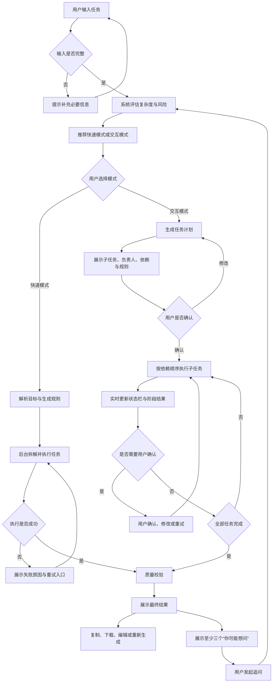

### 6.1 智能体助手互动用户流程

> 本节专章整理**办公写作 Agent（智能体助手）**在 `index.html` 原型 V1.10–V1.36 中已实现的关键互动路径。每项功能均独立给出「用户使用流程」流程图，并与 §3.2、§7.0、§8、§9.4 等规则对齐。流程图节点描述**用户可见动作**与**系统反馈**，供产品、设计、研发与测试统一验收口径。

#### 6.1.1 登录与进入智能体助手

**场景说明**：用户从启动页进入登录页，验证通过后进入办公写作 Agent 主界面（侧边栏 + 首页输入区 + 智能体团队卡片）。

**关键交互细节**

- 登录页支持用户名/密码输入、密码显隐切换、Enter 键提交。
- 登录成功后隐藏登录层，展示 Agent 主界面；未登录时不可访问任务流与侧边栏功能。
- 左上角 Logo「midu｜模力通」在任意子页面点击可返回首页输入区并重置当前任务状态。

**用户使用流程**

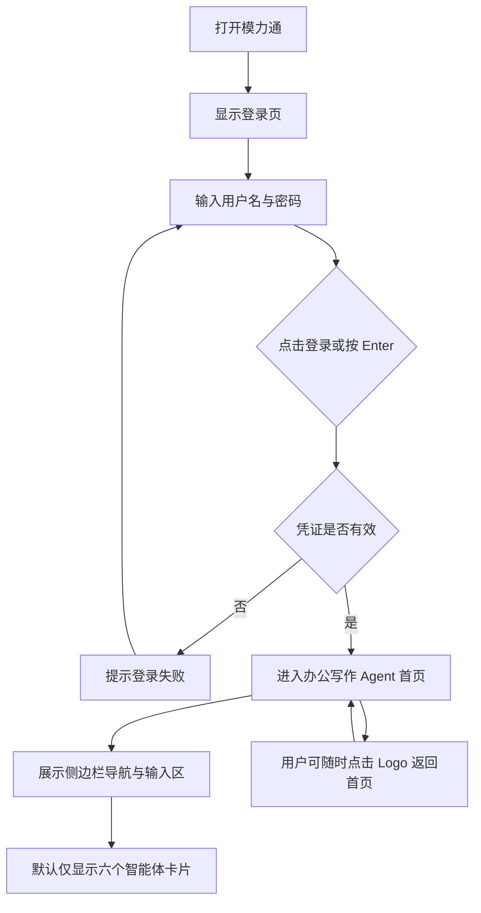

#### 6.1.2 首页功能入口与模式 Tag 选择

**场景说明**：用户在提交任务前，通过「写作 / 深度研究 / AI PPT」三个 pill 或下方案例卡片，明确交付类型与参考 prompt。

**关键交互细节**

- 默认：输入框**无**模式 Tag，占位「请输入内容开始写作」，下方**仅**展示六个智能体卡片，模式预览区隐藏。
- 点击 pill 或案例：输入框左上角显示对应 Tag（绿/橙/紫）；pill 与智能体之间展开该模式案例区。
- Tag 右侧 ×：取消模式，恢复默认占位，隐藏案例区。
- 未选 Tag 直接提交：系统按 prompt 关键词推断模式，否则默认「写作」。

**用户使用流程**

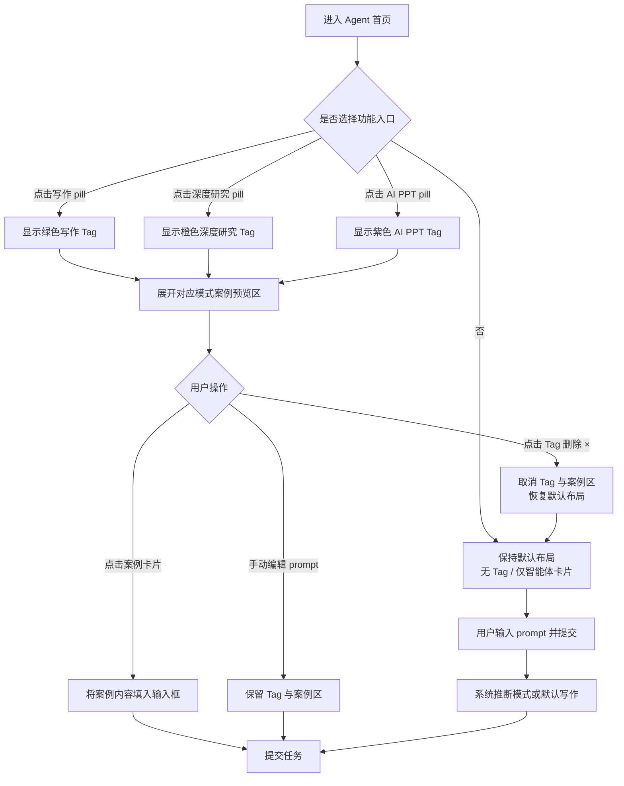

#### 6.1.3 智能体模式与快速/交互模式切换

**场景说明**：用户在输入框工具栏激活「智能体」模式，并选择快速模式或交互模式，决定任务执行透明度与参与程度。

**关键交互细节**

- 默认隐藏「快速模式」按钮；仅点击「智能体」后在其旁显示，并可展开快速/交互面板。
- 点击「写作」「深度研究」pill 时自动激活智能体模式并预选交互模式。
- 用户手动选择的模式在当前会话中保持，系统推荐不得强制覆盖。
- 输入区另提供「文风助手库」入口（见 §6.1.12），与模式选择正交。

**用户使用流程**

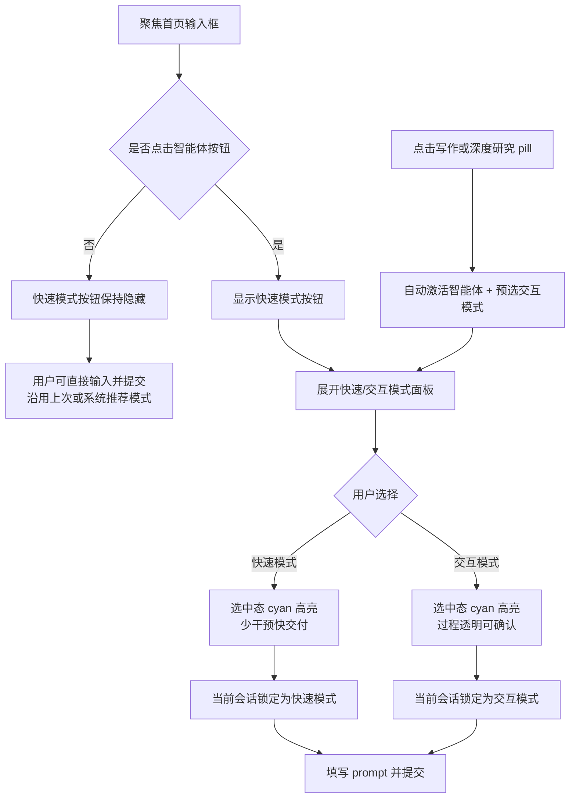

#### 6.1.4 快速模式：任务提交至交付

**场景说明**：用户选择快速模式后提交任务，系统后台拆解并执行，对话页展示精简进度与最终交付，适合步骤少、信息完整的任务。

**关键交互细节**

- 提交后切换至对话页：顶部进度条、可滚动聊天流、底部固定输入框。
- 中间步骤进度按权重计算，最高 99%；仅最终交付时显示 100% 与绿色完成态。
- 按所选功能入口交付对应 mock：Word / 学术论文 / PPT 预览 + 可下载文件卡片。
- 交付后展示「你可能想问」（至少 3 条，与 prompt 语境匹配）。

**用户使用流程**

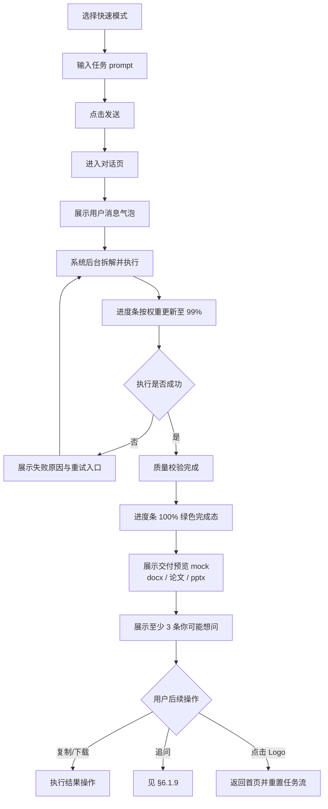

#### 6.1.5 交互模式：补充信息问卷与多智能体协作

**场景说明**：用户选择交互模式提交任务后，系统先收集补充信息，再展示六智能体分工，按阶段 handoff 执行至交付。

**关键交互细节**

- 对话流**首先**展示「补充信息」调查问卷；题目须与 prompt 语境一致（如西式婚礼不出现中式习俗题）。
- 问卷尽量覆盖价格/预算、喜好、文化习俗等维度；用户确认后展示六位智能体任务分工。
- 六智能体按 §7.0 职责顺序 handoff：统筹规划 → 检索 → 文献/研究分析 → 写作 → 编辑校对 → 统筹交付。
- 待办事项、负责人交接、工具日志、大纲确认等中间产物在聊天流内嵌展示。

**用户使用流程**

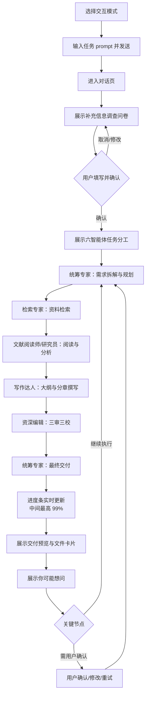

#### 6.1.6 写作功能用户使用流程

**场景说明**：用户选择「写作」入口，通过文档模板或自定义 prompt 生成办公文档，最终交付 Word（`.docx`）。

**关键交互细节**

- 首页案例区：推荐 / 通知通告 / 总结汇报 / 会议 / 新闻稿件 / 公文 Tab + 模板卡片网格。
- 简单单篇推荐快速模式；跨文档整合、长篇报告推荐交互模式。
- 快速流程：解析 → 撰写 → 校对 → 交付；交互流程：规划 → 大纲 → 资料 → 分析 → 分章 → 三审三校 → 交付。
- 对话页展示 Word 文档预览 mock（绿色标题栏 + 正文摘要）。

**用户使用流程**

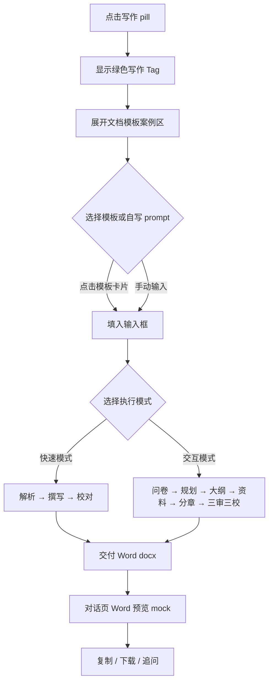

#### 6.1.7 深度研究功能用户使用流程

**场景说明**：用户选择「深度研究」入口，系统按论文写作流程组织多智能体协作，交付学术论文（`.docx`）。

**关键交互细节**

- 首页案例区：横向滚动研究论文案例卡片（标题 + 摘要）。
- **固定**走交互模式；流程：话题拆分 → 维度分解 → 资料检索 → 文献研读 → 论文撰写 → 三审三校 → 交付。
- 对话页展示学术论文预览 mock（橙色标题栏 + 摘要/章节结构）。

**用户使用流程**

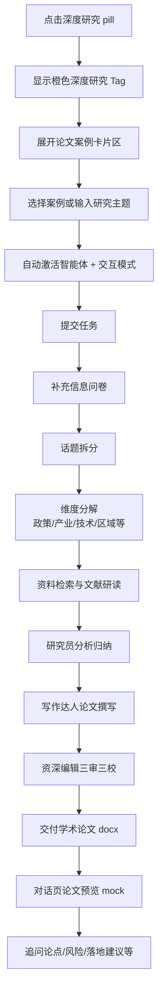

#### 6.1.8 AI PPT 功能用户使用流程

**场景说明**：用户选择「AI PPT」入口，根据主题与要点生成演示文稿，默认快速交付 `.pptx`。

**关键交互细节**

- 首页案例区：横向滚动 PPT 封面/标题页预览卡片。
- 默认快速模式；含多文件整合需求时可切换交互模式。
- 流程：解析演示需求 → 规划页序 → 生成幻灯片 → 版式校对 → 交付。
- 对话页展示 16:9 主幻灯片 + 缩略图条 mock。

**用户使用流程**

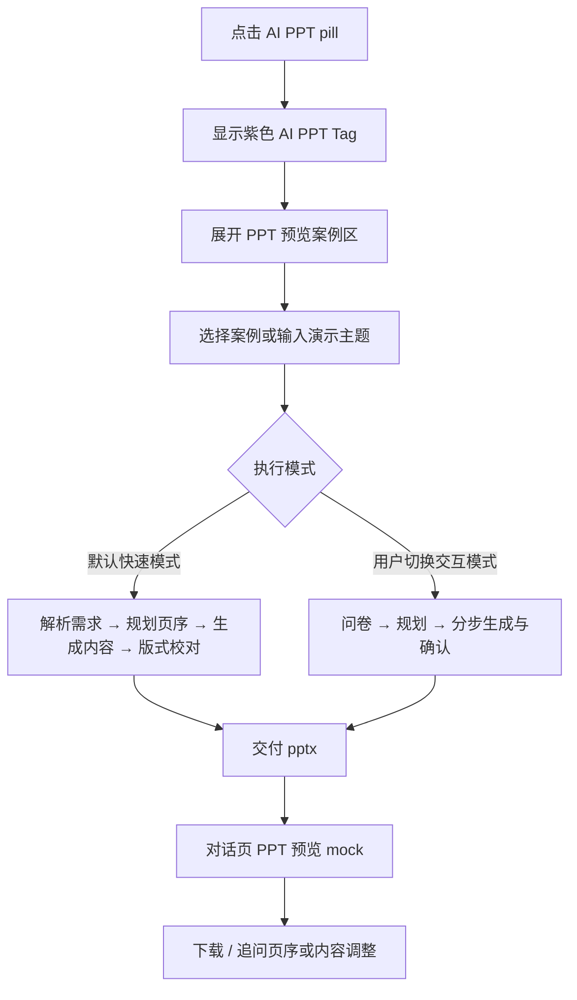

#### 6.1.9 对话页追问与续问

**场景说明**：任务交付完成后，用户可在同一对话流内继续提问；系统基于初始任务与交付结果上下文回复，并动态推荐后续问题。

**关键交互细节**

- 底部固定输入框支持 Enter 发送追问；也可点击「你可能想问」chip 一键填入。
- 每轮「用户提问 → AI 回复」后，在 AI 回复下方追加新的「你可能想问」（排除已问过的问题）。
- 首次交付时的评分区仍保留首次推荐问题；追问回复须引用任务上下文。
- 推荐问题须与 prompt 语境匹配（如西式婚礼问预算与仪式偏好，研究报告问论点与落地风险）。

**用户使用流程**

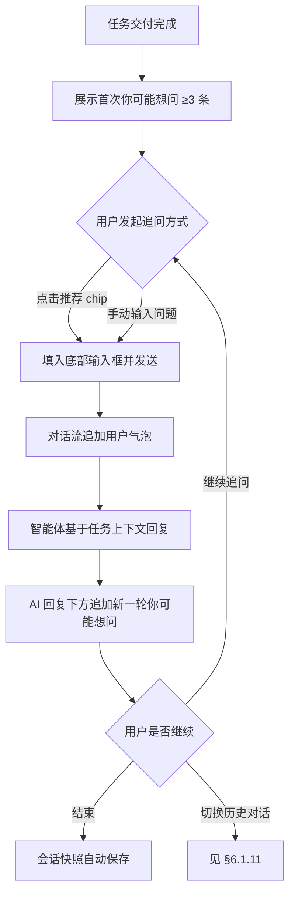

#### 6.1.10 问答书签导航

**场景说明**：长对话中，用户通过右侧中部书签快速定位历次提问位置；书签在滚动时保持屏幕固定。

**关键交互细节**

- 书签默认展示当前用户问答序号（首次提交为 1，追问依次递增）。
- 点击展开全部用户问答列表：每项为「序号 + 问题开头文字」，尾部渐淡省略。
- 点击列表条目：聊天区滚动定位至对应对话气泡。
- 书签采用 **fixed 定位**，滚动对话内容时不随页面移动。

**用户使用流程**

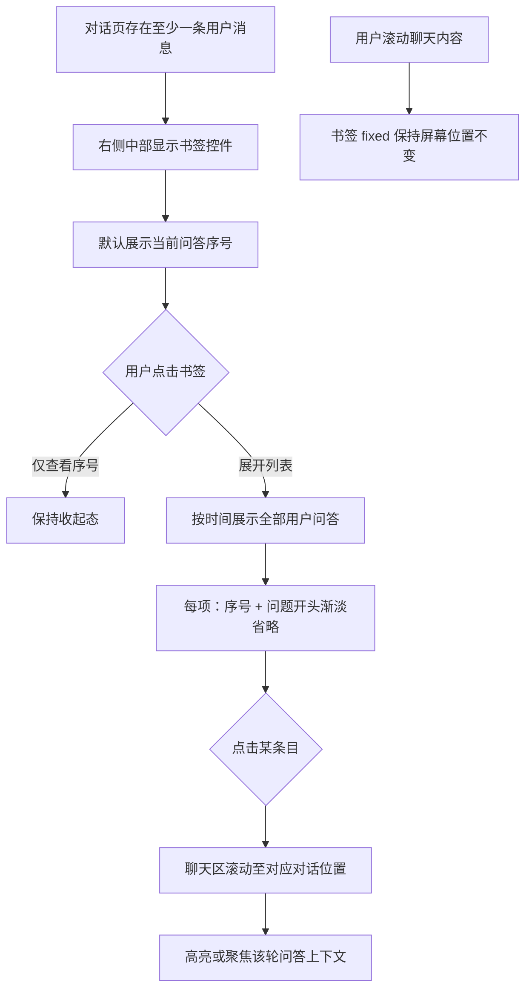

#### 6.1.11 历史对话恢复与管理

**场景说明**：用户通过侧边栏「最近对话」恢复既往会话，或在条目间切换；系统保留完整末状态，不重新执行任务流。

**关键交互细节**

- 每条最近对话左侧显示模式 Tag（绿写作 / 橙深度研究 / 紫 AI PPT）。
- 点击条目：从 sessionStorage 快照恢复聊天流、进度条、交付预览、追问、书签状态等。
- **不得**重新触发任务流模拟或清空已有结果。
- 切换对话时自动保存当前会话快照；当前条目深灰背景选中态。
- 支持 hover 显示删除图标并删除条目（同步清除快照）。

**用户使用流程**

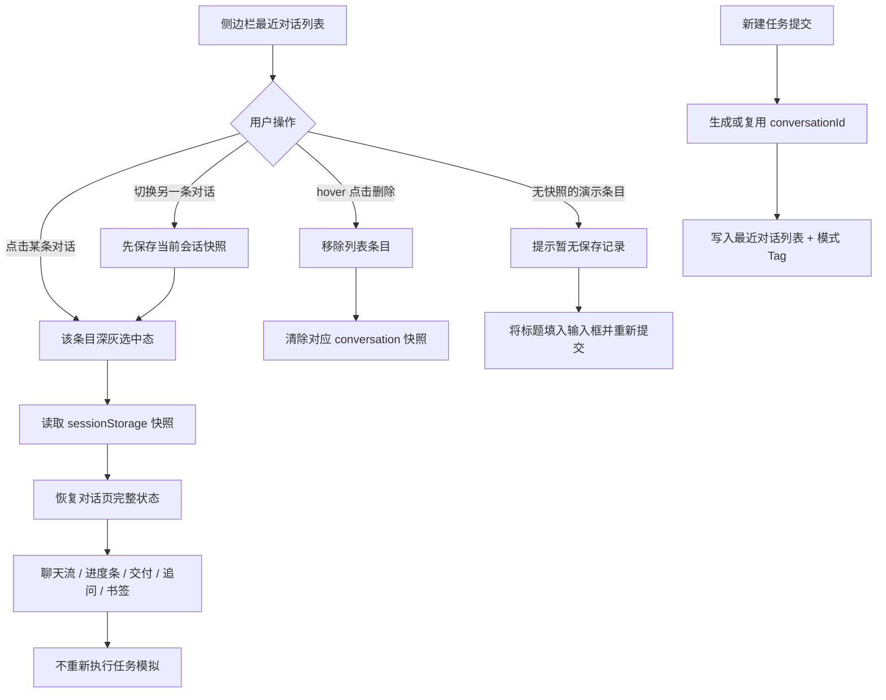

#### 6.1.12 文风助手库创建

**场景说明**：用户从输入框「文风助手库」进入列表弹窗，再进入双栏创建页，上传参考资料生成可复用文风。

**关键交互细节**

- 列表弹窗（图1）：空状态居中图标 +「还没有文风助手」+「创建文风」入口。
- 创建页（图2）：左侧基本信息（文风名称*、介绍、参考资料*）；右侧引导与解析预览。
- 支持点击或拖拽上传 PDF/Word/TXT/wps；展示文件列表与解析状态。
- 解析完成后右侧显示标签页分析结果（创作思路与方法等）；按钮由「创建文风」切换为「更新文风」。

**用户使用流程**

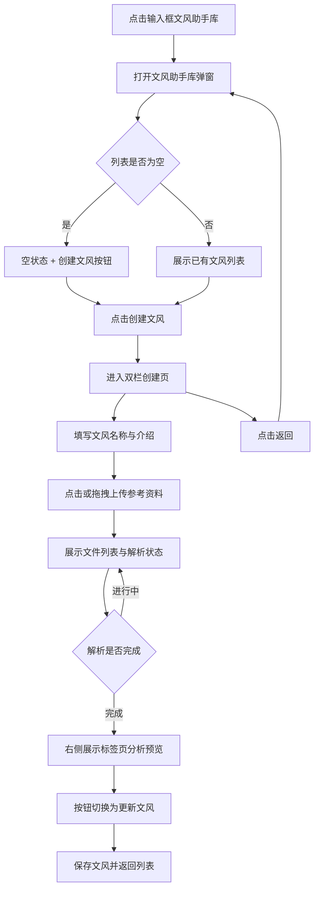

#### 6.1.13 AI 内容审校

**场景说明**：用户从侧边栏进入 AI 内容审校工作台，输入或上传文本后配置校对规则并执行智能校对。

**关键交互细节**

- 顶部：上传文档、选择校对类型、自定义词库；右侧统计条（今日/单次检测字数、升级）。
- 中部：富文本工具栏 + 编辑区；底部：复制、清空、导出文档、智能校对。
- 右侧：空状态插图 +「校对结果」分类条（全部/严重/一般/疑似/自定义/风险/修改记录，初始均为 0）。
- 点击「选择校对类型」：弹出「选择校对项」模态，四类规则网格（文字标点、知识性、内容导向风险、自定义词），支持全选、专项设置、取消/确定；Esc 可关闭。

**用户使用流程**

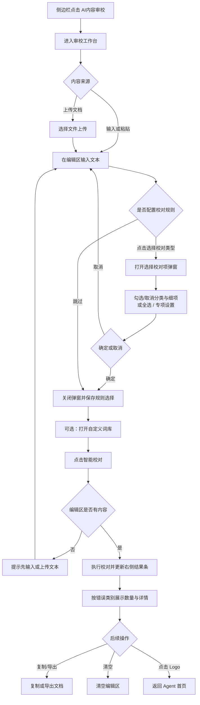

## 7. 深度研究任务流及生成规则

### 7.0 办公写作智能体团队

办公写作 Agent 由六类专职智能体组成，首页「您的智能体团队」区与任务流中的负责人展示均以下表为准。每个智能体只参与与其职责相关的阶段；跨阶段协作时由**统筹专家**调度，但子任务主负责人仍按本节定义唯一归属。

| 智能体 | 角色定位 | 首页能力标签 | 核心职责 | 专业价值 |
| --- | --- | --- | --- | --- |
| **写作达人** | 写作专家、内容生成专家 | 大纲写作；极速写作；公文写作 | **文稿写作**：短时间内生成高质量初稿，支持内容补全与续写。<br>**代码生成**：生成页面及命令行代码，支持更多类型任务。 | AI 办公写作、公文起草、PPT 生成 |
| **统筹专家** | 任务管理专家 | 需求拆解；任务规划 | **需求拆解**：深刻理解用户输入，将需求拆解为分步执行的待办事项。<br>**规划执行**：调度其他智能体成员，共同执行任务。 | 分析需求，提出执行步骤和解决方案 |
| **检索专家** | 精准信息收集专家 | 信息收集；自动判别 | **信息收集**：快速检索全网权威信息，覆盖新闻、数据、资料等多类型内容。<br>**自动判别**：自动判别符合当前主题的检索信息，进行筛选与总结。 | 确保生成内容中的信息实时、真实、有效 |
| **文献阅读师** | 专业文献处理与知识提取助手 | 深度研读；辅助阅读 | **深度研读**：深度阅读用户提供的文献，挖掘重要信息。<br>**辅助阅读**：生成总结、导读等内容，辅助用户快速获取关键内容。 | 帮助快速消化长篇文献，提取核心知识，降低专业内容的阅读门槛 |
| **研究员** | 深度研究专家 | 深度研究；数据分析；图表生成 | **深度研究**：针对主题展开系统性分析，输出观点与结论。<br>**数据分析与图表生成**：对证据进行整理、对比与验证，并生成图表及可视化材料。 | 输出有依据的研究结论与数据支撑，提升复杂任务的论证深度 |
| **资深编辑** | 内容校对与风险把控专家 | 文字校对；标点校对；知识校对 | **文字标点校对**：修正错别字、标点语病、用词不当。<br>**知识校对**：核查内容中的事实错误、概念偏差；审查内容导向风险。 | 让内容更严谨、专业、安全，避免低级错误与潜在风险 |

**与任务流阶段的默认映射**

| 任务流阶段（§7.1） | 主负责智能体 | 说明 |
| --- | --- | --- |
| 需求理解、任务规划、最终交付 | 统筹专家 | 统筹专家负责拆解、调度与结果交付；大纲生成等撰写类子任务可交由写作达人执行 |
| 资料检索 | 检索专家 | 仅负责外部信息检索、筛选与来源整理 |
| 文献阅读 | 文献阅读师 | 仅处理用户上传或指定文献的深度阅读与摘要 |
| 分析归纳 | 研究员 / 文献阅读师 | 含「深度研究、分析、论证」等意图时由研究员负责；否则由文献阅读师做证据归纳 |
| 内容撰写 | 写作达人 | 负责大纲、分章撰写、合并成稿 |
| 质量校验 | 资深编辑 | 负责三审三校及风险审查，完成后交还统筹专家交付 |

**展示规则**

1. 首页智能体卡片、对话页「当前负责人」、待办事项右侧负责人名称，均须与本节「智能体」列一致。
2. 能力标签用于卡片副标题与负责人行次级标签，例如「检索专家 · 信息收集」。
3. 用户从首页点击某智能体卡片时，仅表示希望该智能体**优先参与**其职责范围内的工作，不得越权替代其他智能体的主责阶段。
4. 每个智能体详情页（「个人简历」）可展开展示上表「核心职责」与「专业价值」全文。

### 7.1 阶段划分

| 阶段 | 目标 | 默认负责人 | 输入 | 输出 | 是否需确认 |
| --- | --- | --- | --- | --- | --- |
| 需求理解 | 识别研究目标、范围和约束 | 统筹专家 | 用户输入、附件、会话上下文 | 需求摘要、待澄清项 | 有关键歧义时 |
| 任务规划 | 将研究目标拆为可执行任务 | 统筹专家 | 需求摘要 | 任务列表、依赖、负责人 | 交互模式默认需要 |
| 资料检索 | 获取与任务相关的资料 | 检索专家 | 检索式、资料范围 | 来源列表、资料摘要 | 否 |
| 文献阅读 | 提取证据、观点和数据 | 文献阅读师 | 来源资料 | 证据卡片、引用片段 | 否 |
| 分析归纳 | 对比、验证并形成结论 | 研究员 | 证据卡片、任务规则 | 分析结论、图表数据 | 高风险结论需要 |
| 内容撰写 | 按结构和文风生成正文 | 写作达人 | 分析结论、文风、模板 | 报告初稿 | 否 |
| 质量校验 | 检查事实、引用、结构和语言 | 资深编辑 | 报告初稿、来源 | 问题清单、修订稿 | 有严重问题时 |
| 最终交付 | 组织结果并提供后续操作 | 统筹专家 | 修订稿、过程记录 | 最终结果、来源、“你可能想问” | 否 |

### 7.2 任务拆解规则

每个子任务必须满足以下条件：

1. **目标单一**：一个任务只对应一个可验收目标。
2. **输入明确**：标注依赖的文件、来源或前置任务。
3. **负责人唯一**：每个任务只有一个主负责智能体，可有协作智能体。
4. **输出可验证**：必须定义输出类型和完成标准。
5. **依赖可追踪**：依赖其他任务时，前置任务完成前不得进入执行中。
6. **风险有标识**：涉及事实判断、敏感内容或来源不足时显示风险标签。
7. **粒度受控**：单个任务预计执行时间超过系统阈值时应继续拆分。

### 7.3 状态栏展示规则

总体状态栏固定展示以下信息：

1. **模式与阶段**
   - 当前模式
   - 当前阶段，例如“正在检索资料”
2. **进度信息**
   - 已完成任务数/总任务数
   - 总体进度百分比
3. **执行主体**
   - 当前负责人
   - 已用时间
4. **可执行操作**
   - 暂停、取消、查看详情等

示例：

> 交互模式 · 正在分析归纳 · 4/7 个任务已完成 · 研究员执行中

#### 7.3.1 【新增需求】任务流百分比进度条

每一条主任务流和可独立执行的子任务流均需提供可视化进度追踪，不得只用“执行中”等文字代替进度。

| 展示对象 | 展示位置 | 必须展示的内容 |
| --- | --- | --- |
| 主任务 | 页面顶部固定状态栏 | 总体百分比进度条、当前阶段、已完成/总任务数、当前负责人 |
| 阶段任务 | 任务流阶段标题下方 | 阶段百分比、阶段内已完成/总任务数、当前执行节点 |
| 子任务 | 子任务卡片内部 | 子任务百分比进度条、状态、负责人、最近一次更新时间 |
| 折叠任务组 | 折叠标题行 | 聚合百分比、异常任务数、待确认任务数 |

进度条展示规则：

1. 进度条范围为 0%–100%，同时显示数字百分比，不得仅以颜色或长度表达。
2. 进度条右侧同步展示状态文案，例如“资料检索中 · 45%”。
3. 正常执行使用主题蓝色；待用户确认使用橙色；失败使用红色；完成使用绿色；暂停使用灰色。
4. 快速模式默认展示单条精简总体进度条，展开后可查看系统内部任务节点。
5. 交互模式默认展示总体进度条和完整任务节点，可展开查看每个子任务进度。
6. 进度变化应平滑更新；单次更新频率不高于每秒一次，避免界面频繁跳动。
7. 正常情况下已展示的百分比不得倒退。任务重规划导致进度重新计算时，必须说明原因并标记“计划已更新”。
8. 任务进入待确认或暂停状态时，进度条停止变化，并在进度条附近展示所需操作。
9. 任务失败时保留失败前的进度，不得直接归零；重试后沿用原任务记录并重新计算受影响节点。
10. 任务完成后进度固定为 100%，同时展示完成时间和结果入口。
11. 进度条需要满足无障碍要求，提供可读的 `aria-valuenow`、`aria-valuemin`、`aria-valuemax` 和状态文本。

进度计算规则：

```text
主任务进度 = Σ（子任务权重 × 子任务进度）÷ Σ（全部子任务权重）
阶段进度 = Σ（阶段内子任务权重 × 子任务进度）÷ Σ（阶段内全部子任务权重）
```

1. **权重规则**
   - 子任务默认权重为 1
   - 系统可根据预计工作量设置权重，但必须在任务详情中可查看
2. **状态对应进度**
   - `pending` 和 `ready` 状态默认进度为 0%
   - `running` 状态根据智能体上报的已完成节点计算，禁止仅按等待时间虚增进度
   - `waiting_user`、`paused` 和 `failed` 状态沿用进入该状态前的进度
   - `succeeded` 状态固定为 100%
   - `cancelled` 不计入剩余进度，但总体状态需标记任务计划发生变化
3. **重规划规则**
   - 新增、删除或重新拆分子任务时，服务端重新计算总体进度
   - 必须向客户端下发变更原因

### 7.4 子任务状态规则

| 状态代码 | 展示名称 | 视觉建议 | 进入条件 | 可用操作 |
| --- | --- | --- | --- | --- |
| `pending` | 等待执行 | 灰色圆点 | 任务已创建，前置条件未满足 | 查看详情、取消 |
| `ready` | 准备执行 | 蓝色空心圆 | 前置条件已满足，等待调度 | 立即执行、调整负责人 |
| `running` | 执行中 | 蓝色动态进度 | 智能体已开始处理 | 查看过程、暂停、取消 |
| `waiting_user` | 待你确认 | 橙色提示 | 需要补充信息或确认阶段结果 | 确认、修改、驳回 |
| `paused` | 已暂停 | 黄色暂停图标 | 用户或系统暂停 | 继续、取消 |
| `succeeded` | 已完成 | 绿色对勾 | 输出通过任务级校验 | 查看、复制、重新执行 |
| `failed` | 执行失败 | 红色警示 | 工具、模型、网络或规则校验失败 | 重试、修改任务、反馈 |
| `cancelled` | 已取消 | 灰色删除线 | 用户取消或上游任务终止 | 重新创建 |

### 7.5 负责人展示规则

1. **基础展示**
   - 展示智能体头像、名称和能力标签，例如“检索专家 · 信息收集”
   - 名称与能力标签须与 [§7.0 办公写作智能体团队](#70-办公写作智能体团队) 定义一致
2. **协作展示**
   - 协作任务展示“主负责人 + N 位协作者”
   - 展开后查看完整名单
3. **变更与执行状态**
   - 负责人切换时保留变更记录
   - 执行中任务需明确当前正在工作的负责人
4. **异常处理**
   - 负责人不可用时，状态变为“等待调度”
   - 不得仍显示“执行中”

### 7.6 阶段结果展示规则

每个已完成任务至少展示：

1. **基础信息**
   - 任务标题和完成时间
   - 负责人
2. **结果摘要**
   - 不超过 120 字的结果摘要
   - 输出类型，例如资料、结论、提纲、正文、数据表
3. **依据与验收**
   - 来源数量及可展开的来源列表
   - 与验收规则的匹配情况
4. **可用操作**
   - 复制、引用到正文、下载、重新执行、反馈等

失败场景补充规则：

- 不得生成伪结果
- 必须展示失败原因、已完成部分及影响范围

## 8. 文风库

### 8.1 预置文风

| 文风 | 适用场景 | 核心规则 |
| --- | --- | --- |
| 正式严谨 | 公文、报告、制度 | 用词规范，结论明确，避免口语化和无依据修饰 |
| 简洁清晰 | 摘要、通知、工作沟通 | 短句优先，减少重复，先结论后说明 |
| 亲切自然 | 内部沟通、活动内容 | 语气友好，表达自然，避免过度营销 |
| 专业研究 | 行业研究、方案论证 | 概念准确，论证完整，数据和来源可追溯 |
| 宣传表达 | 新闻稿、品牌内容 | 重点突出，节奏鲜明，但不得夸大事实 |

### 8.2 文风生效规则

1. **作用范围**
   - 文风作用于当前任务的所有撰写类子任务
2. **优先级规则**
   - 用户明确输入的语气要求优先于预置文风
   - 企业强制文风优先于个人文风，并应向用户说明
3. **切换影响**
   - 切换文风不自动重跑检索与分析任务
   - 只重新执行受影响的撰写和校验任务
4. **结果页表现**
   - 结果页需显示当前使用的文风
   - 支持一键切换后重新生成

## 9. 结果展示方案

### 9.1 推荐结构

最终结果采用“可阅读正文 + 可验证依据 + 可继续操作”的三层结构：

1. **结果摘要**：结论、关键数据、风险提示。
2. **完整正文**：按标题层级展示，可折叠长章节。
3. **依据与过程**：来源、任务记录、生成规则、智能体分工。

### 9.2 内容组件

1. **正文类组件**
   - 正文段落
   - 数据卡片
   - 表格
   - 图表
2. **依据类组件**
   - 引用卡片
   - 附件列表
3. **交互类组件**
   - 风险提示
   - 待确认事项

### 9.3 用户后续操作

| 操作 | 作用范围 | 规则 |
| --- | --- | --- |
| 复制 | 全文、章节、选中内容 | 保留基础格式，可选择是否附带来源 |
| 下载 | DOCX、PDF、Markdown | 文件名默认使用任务名称和日期 |
| 编辑 | 正文或局部段落 | 进入可编辑状态并自动保存草稿 |
| 重新生成 | 全文、章节、段落 | 明确显示将被覆盖的范围 |
| 切换文风 | 撰写类内容 | 保留原版本并生成新版本 |
| 引用来源 | 单条来源 | 在正文插入标准引用标记 |
| 分享 | 结果页 | 根据权限生成只读链接 |
| 反馈 | 单段或整体 | 可标记事实错误、遗漏、文风问题 |
| 保存模板 | 结构与规则 | 不默认保存敏感正文内容 |

### 9.4 “你可能想问”规则

1. **数量要求**
   - 每次最终结果至少生成 3 个问题
   - 默认最多展示 5 个
2. **内容覆盖**
   - 至少覆盖以下三类：
     - 结论深化
     - 风险或反例
     - 下一步行动
3. **质量约束**
   - 问题不得与用户原始问题完全重复
   - 问题应可由当前结果和已有资料继续回答
4. **点击行为**
   - 点击问题后继承当前任务上下文
   - 明确使用当前模式还是新建任务

示例：

1. 这些结论在不同地区是否存在明显差异？
2. 当前方案最大的执行风险是什么？
3. 如何把研究结果转化为下季度行动计划？

## 10. Web 与桌面端一致性规则

| 范围 | 一致性要求 |
| --- | --- |
| 信息架构 | 模式入口、文风入口、附件入口、任务状态和结果操作顺序一致 |
| 术语 | 两端统一使用“快速模式”“交互模式”“待你确认”等文案 |
| 状态 | 同一任务在两端显示相同状态、进度和负责人 |
| 操作 | 提交、确认、暂停、重试、复制、下载的行为一致 |
| 快捷键 | 桌面端可增加快捷键，但不得替代可见操作入口 |
| 系统能力 | 桌面端可增强本地文件和通知能力，Web 端提供等价替代路径 |
| 任务续接 | 用户切换端后应恢复到同一任务和最近查看位置 |
| 异常提示 | 错误代码、原因和恢复建议保持一致 |

## 11. 关键数据字段定义

| 字段名 | 类型 | 是否必填 | 示例 | 定义/规则 |
| --- | --- | --- | --- | --- |
| `conversation_id` | String | 是 | `conv_20260813_001` | 会话唯一标识 |
| `task_id` | String | 是 | `task_001` | 主任务唯一标识 |
| `task_title` | String | 是 | `新能源汽车行业研究` | 用户可编辑的任务名称 |
| `task_mode` | Enum | 是 | `interactive` | `quick` 或 `interactive` |
| `mode_recommendation` | Enum | 否 | `interactive` | 系统推荐模式 |
| `recommendation_reason` | String | 否 | `涉及多来源研究与七个子任务` | 推荐原因 |
| `task_status` | Enum | 是 | `running` | 主任务当前状态 |
| `current_stage` | Enum | 是 | `analysis` | 当前研究阶段 |
| `progress_percent` | Integer | 是 | `57` | 0–100，按已完成权重计算 |
| `stage_progress_percent` | Integer | 是 | `62` | 当前阶段的加权进度，范围 0–100 |
| `subtask_progress_percent` | Integer | 是 | `45` | 单个子任务执行进度，范围 0–100 |
| `progress_updated_at` | Datetime | 是 | `2026-08-13T02:33:12Z` | 最近一次进度更新时间 |
| `progress_change_reason` | String | 否 | `新增竞品数据检索任务` | 进度重算或计划变更原因 |
| `task_weight` | Number | 是 | `1.5` | 子任务在主任务进度计算中的权重 |
| `completed_subtask_count` | Integer | 是 | `4` | 已完成子任务数 |
| `total_subtask_count` | Integer | 是 | `7` | 子任务总数 |
| `style_id` | String | 否 | `style_professional` | 当前文风标识 |
| `style_source` | Enum | 否 | `preset` | `preset`、`personal`、`enterprise` |
| `subtask_id` | String | 是 | `subtask_004` | 子任务唯一标识 |
| `subtask_title` | String | 是 | `分析市场规模` | 子任务名称 |
| `subtask_status` | Enum | 是 | `running` | 子任务状态 |
| `owner_agent_id` | String | 是 | `agent_researcher` | 主负责智能体标识 |
| `owner_agent_name` | String | 是 | `研究员` | 主负责智能体显示名称 |
| `collaborator_agent_ids` | Array<String> | 否 | `["agent_search"]` | 协作智能体列表 |
| `dependency_ids` | Array<String> | 否 | `["subtask_002"]` | 前置子任务列表 |
| `generation_rule_ids` | Array<String> | 是 | `["rule_citation"]` | 适用生成规则 |
| `acceptance_criteria` | Array<String> | 是 | `["至少引用3个来源"]` | 子任务完成标准 |
| `result_type` | Enum | 是 | `evidence_cards` | 输出类型 |
| `result_summary` | String | 否 | `共整理12条有效证据` | 阶段结果摘要 |
| `result_content` | Object | 否 | `{...}` | 结构化结果内容 |
| `source_count` | Integer | 否 | `12` | 有效来源数量 |
| `sources` | Array<Object> | 否 | `[{title,url,...}]` | 来源明细 |
| `failure_code` | String | 否 | `SOURCE_TIMEOUT` | 失败错误码 |
| `failure_message` | String | 否 | `部分来源访问超时` | 面向用户的失败说明 |
| `requires_user_action` | Boolean | 是 | `true` | 是否需要用户介入 |
| `available_actions` | Array<String> | 是 | `["confirm","retry"]` | 当前允许操作 |
| `started_at` | Datetime | 否 | `2026-08-13T02:30:00Z` | 开始时间 |
| `completed_at` | Datetime | 否 | `2026-08-13T02:35:00Z` | 完成时间 |
| `suggested_questions` | Array<String> | 否 | `["主要风险是什么？"]` | 至少 3 条后续问题 |
| `result_version` | Integer | 是 | `3` | 结果版本号 |
| `client_type` | Enum | 是 | `desktop` | `web` 或 `desktop` |

## 12. 异常场景与边界条件

| 场景 | 产品处理规则 |
| --- | --- |
| 用户输入为空 | 禁止提交，提示输入任务目标。 |
| 任务目标过于宽泛 | 推荐交互模式，并要求补充范围、对象、时间或输出格式。 |
| 用户选择快速模式但任务过于复杂 | 允许继续，但提示可能影响完整性，并提供切换交互模式入口。 |
| 执行中切换模式 | 先提示影响范围；已完成结果保留，未执行任务按新模式重新规划。 |
| 执行中切换文风 | 仅影响后续撰写任务；已生成内容需用户确认是否重新生成。 |
| 资料来源不足 | 明确标记“证据不足”，不得输出确定性结论。 |
| 来源冲突 | 并列展示冲突观点、来源和系统判断依据。 |
| 来源失效或无权限 | 显示不可访问状态，并支持替换来源或跳过。 |
| 单个子任务失败 | 不立即终止全部任务；评估依赖关系后继续无依赖任务。 |
| 关键子任务失败 | 暂停受影响任务，展示影响范围和恢复方案。 |
| 用户长时间未确认 | 任务进入待确认状态；按通知策略提醒，不自动代替用户确认。 |
| 进度长时间不变化 | 显示“进度更新延迟”，保留最近更新时间，并允许查看任务日志或重试。 |
| 客户端与服务端进度不一致 | 以服务端进度为准，客户端平滑校正并提示“进度已同步”。 |
| 任务重规划导致进度下降 | 说明新增或重拆任务原因，标记“计划已更新”，不得无提示回退。 |
| 部分子任务无法计算百分比 | 展示不确定进度状态及已完成节点数，不得伪造百分比。 |
| 用户取消任务 | 停止未开始任务；已完成结果保留并可导出。 |
| 重复点击提交 | 使用幂等键避免创建重复任务，并提示任务已提交。 |
| 网络断开 | 本地保留输入；恢复后同步最新任务状态。 |
| 跨端同时操作 | 按服务器最新版本合并；冲突操作要求用户确认。 |
| 内容超长 | 分章节生成；明确整体进度并防止章节丢失。 |
| 上传文件超限 | 提示大小、数量和格式限制，并指出超限文件。 |
| 敏感或违规内容 | 中止相关任务，说明规则类型并提供合规修改建议。 |
| 导出失败 | 保留结果，提供重试及其他格式下载。 |
| 追问不足 3 条 | 使用通用的深化、风险和行动问题补足，但不得生成无关问题。 |
| 智能体不可用 | 显示等待调度或切换备用智能体，不得虚假显示执行中。 |

## 13. 内容质量改进建议

1. **先结论后过程**：默认先展示摘要，避免用户被执行过程淹没。
2. **区分事实与推断**：事实附来源，推断明确标注，不混合作为确定结论。
3. **引用可追溯**：正文引用可跳转到来源片段，而非仅列出链接。
4. **减少模板腔**：禁止重复空泛的开场、总结和“首先、其次、最后”堆叠。
5. **明确不确定性**：资料不足时说明缺口、影响和建议补充方式。
6. **输出可编辑结构**：标题、段落、表格和图表作为独立内容块，方便局部调整。
7. **规则透明但不过载**：默认展示关键规则摘要，完整规则按需展开。

## 14. 验收标准

1. 用户可在输入区看到并切换快速模式与交互模式。
2. 两种模式均有清晰说明，且系统推荐不阻止用户手动选择。
3. 交互模式可展示任务计划、负责人、依赖、状态和阶段结果。
4. **【新增】每条主任务、阶段任务和子任务流均能显示可视化进度条及数字百分比，计算结果与服务端字段一致。**
5. **【新增】待确认、暂停、失败、重试和任务重规划时，进度条表现符合 7.3.1 的状态及重算规则。**
6. 状态名称和可用操作与本 PRD 状态规则一致。
7. 深度研究完整覆盖七个阶段，并能处理单任务失败和关键任务失败。
8. 最终结果支持复制和至少三种下载格式。
9. 最终结果后展示至少三个相关的“你可能想问”。
10. 文风选择可影响撰写结果，切换文风不会无故重跑检索任务。
11. Web 和桌面端核心入口、术语、状态与主要操作一致。
12. 所有异常状态都提供原因、影响范围和至少一个恢复动作。

## 15. 待澄清问题

1. 快速模式和交互模式是由用户自由选择，还是企业管理员可限制某些任务只能使用指定模式？
2. 系统推荐模式的复杂度阈值如何定义，是否需要按部门、用户或任务类型配置？
3. 交互模式有哪些必须由用户确认的节点？是否允许用户开启“全部自动确认”？
4. 文风库由谁维护？是否区分平台预置、企业、部门和个人四级权限与优先级？
5. 用户提供示例文本创建文风时，是否允许保存原文，涉及的版权与敏感信息如何处理？
6. 深度研究允许使用哪些外部数据源？是否存在付费来源、内网来源或禁止访问的站点？
7. 来源可信度由什么规则或服务计算，是否需要向用户展示评分依据？
8. 不同智能体的负责人是固定映射还是由调度系统动态选择？用户是否可以手动更换？
9. 任务进度百分比按任务数量还是任务权重计算？预计时间是否需要展示？
10. Web 与桌面端账号、任务和文件是否实时同步？离线状态下桌面端支持到什么程度？
11. 结果下载的 DOCX/PDF 模板、字体、页眉页脚和水印是否有企业级规范？
12. “你可能想问”点击后是在当前会话继续，还是创建新任务？是否继承模式、文风和附件？
13. 用户修改阶段结果后，下游任务是自动失效并重跑，还是由用户选择影响范围？
14. 任务过程记录和生成结果需要保存多久，用户能否彻底删除，是否存在审计要求？
15. 本期成功指标是什么，例如模式选择准确率、任务完成率、确认次数、生成耗时或结果采纳率？
