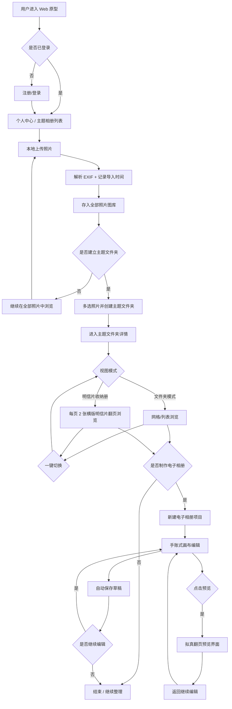
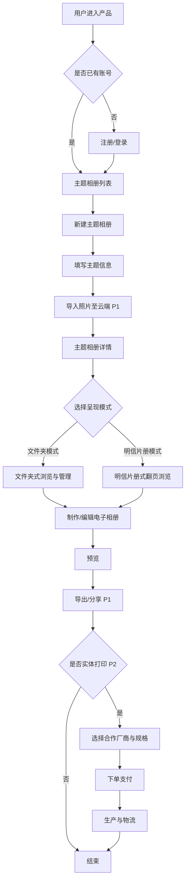
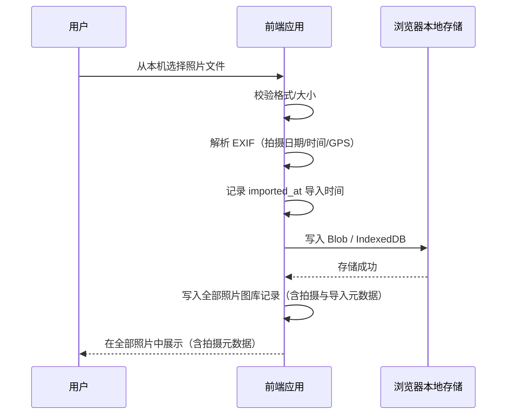
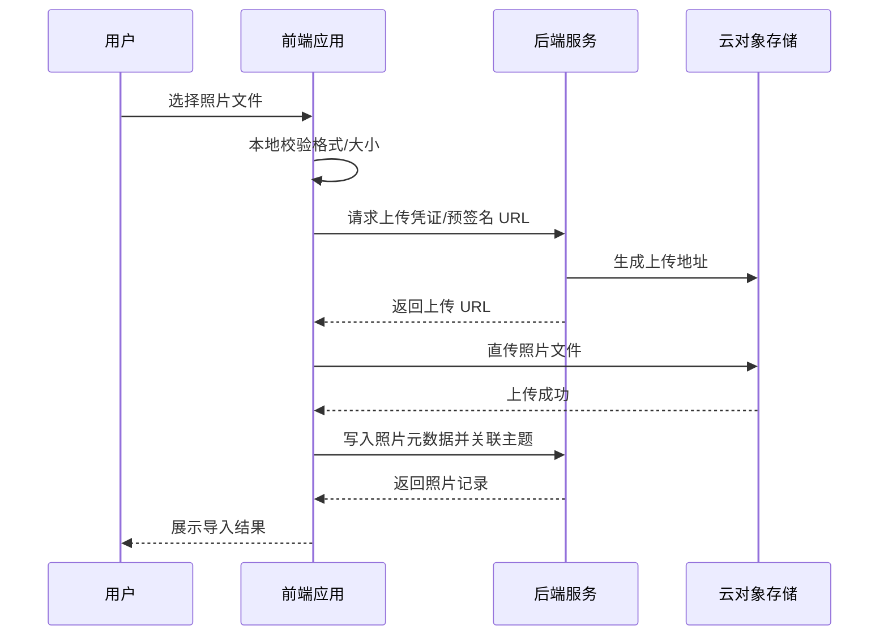

# 主题相册产品 PRD

<!-- PRD_TOC_START -->
## 目录

> 由 `npm run sync-prd` 根据下文标题自动生成，支持点击快速定位。

- [文档信息](#文档信息)
- [修订记录](#修订记录)
- [1. 一句话价值主张](#1-一句话价值主张)
- [2. 目标用户与需求](#2-目标用户与需求)
  - [2.1 核心需求（产品愿景）](#21-核心需求产品愿景)
  - [2.2 目标用户画像](#22-目标用户画像)
    - [共性特征](#共性特征)
    - [年轻人](#年轻人)
    - [老年人](#老年人)
  - [2.3 用户故事](#23-用户故事)
    - [2.3.1 本期原型（P0：Web 网页端）](#231-本期原型p0web-网页端)
    - [2.3.2 下一阶段与远期（P1/P2）](#232-下一阶段与远期p1p2)
- [3. 功能清单](#3-功能清单)
  - [3.1 P0 — 本期原型（Web 网页端）](#31-p0-本期原型web-网页端)
    - [3.1.1 账号与个人中心](#311-账号与个人中心)
    - [3.1.2 照片收纳（本地上传，不含云存储）](#312-照片收纳本地上传不含云存储)
    - [3.1.3 电子相册编辑美化（手账式，参考电子手账软件）](#313-电子相册编辑美化手账式参考电子手账软件)
  - [3.2 P1 — 下一原型阶段与 MVP 扩展](#32-p1-下一原型阶段与-mvp-扩展)
  - [3.3 P2 — 远期能力（商业化与深度能力）](#33-p2-远期能力商业化与深度能力)
- [4. 核心流程图](#4-核心流程图)
  - [4.1 本期原型主流程（P0：Web 网页端）](#41-本期原型主流程p0web-网页端)
  - [4.2 远期主流程（P1/P2：云同步 → 分享 → 打印）](#42-远期主流程p1p2云同步-分享-打印)
  - [4.3 本期原型：本地上传照片流程（P0）](#43-本期原型本地上传照片流程p0)
  - [4.4 远期：照片导入与云存储流程（P1）](#44-远期照片导入与云存储流程p1)
- [5. 关键数据字段定义](#5-关键数据字段定义)
  - [5.1 用户（User）— P0](#51-用户user-p0)
  - [5.2 主题文件夹（ThemeFolder）— P0](#52-主题文件夹themefolder-p0)
  - [5.3 照片（Photo）— P0](#53-照片photo-p0)
  - [5.4 电子相册（DigitalAlbum）— P0](#54-电子相册digitalalbum-p0)
  - [5.5 画布元素（CanvasElement）— P0](#55-画布元素canvaselement-p0)
  - [5.6 素材资源（Asset）— P0](#56-素材资源asset-p0)
  - [5.7 打印订单（PrintOrder）— P2 规划](#57-打印订单printorder-p2-规划)
- [6. 异常场景与边界条件](#6-异常场景与边界条件)
  - [6.1 照片导入（P0：本地上传）](#61-照片导入p0本地上传)
  - [6.2 模式切换与明信片收纳册](#62-模式切换与明信片收纳册)
  - [6.3 电子相册编辑（P0）](#63-电子相册编辑p0)
  - [6.4 账号与个人中心（P0）](#64-账号与个人中心p0)
  - [6.5 云存储与数据安全（P1 起）](#65-云存储与数据安全p1-起)
  - [6.6 原型阶段特有限制](#66-原型阶段特有限制)
- [7. Web 页面原型规范（index.html）](#7-web-页面原型规范indexhtml)
  - [7.1 原型文件与同步机制](#71-原型文件与同步机制)
  - [7.2 技术栈要求](#72-技术栈要求)
  - [7.3 布局与页面结构](#73-布局与页面结构)
  - [7.4 视觉风格与元素规范](#74-视觉风格与元素规范)
  - [7.5 初版交互实现说明（UI-V1.0）](#75-初版交互实现说明ui-v10)
  - [7.6 index.html 修订记录](#76-indexhtml-修订记录)
  - [7.7 页面原型设计待澄清项](#77-页面原型设计待澄清项)
- [8. 下一阶段规划：Web 与小程序差异（P1）](#8-下一阶段规划web-与小程序差异p1)
  - [8.1 账号与个人中心](#81-账号与个人中心)
  - [8.2 照片导入与全部照片库](#82-照片导入与全部照片库)
  - [8.3 主题文件夹与明信片收纳册](#83-主题文件夹与明信片收纳册)
  - [8.4 电子相册编辑（手账式）](#84-电子相册编辑手账式)
  - [8.5 电子相册【预览】拟真翻页](#85-电子相册预览拟真翻页)
  - [8.6 通用差异](#86-通用差异)
- [9. 待进一步澄清的问题](#9-待进一步澄清的问题)
- [附录 A：需求来源摘要（市场部口语）](#附录-a需求来源摘要市场部口语)
- [附录 B：思维导图信息摘要（用户与需求）](#附录-b思维导图信息摘要用户与需求)
- [附录 C：明信片收纳册线框参考](#附录-c明信片收纳册线框参考)

<!-- PRD_TOC_END -->

## 文档信息

| 项目 | 内容 |
|------|------|
| 文档状态 | 第三版（V3.0） |
| 产品代号 | 主题相册（暂定） |
| 目标阶段 | 可交互原型（Prototype） |
| 本期部署 | **Web 网页端**（本期实现重点） |
| 下阶段部署 | 微信小程序（下一原型阶段，见 P1） |
| 文档路径 | `docs/theme-album/PRD.md` |
| 页面原型 | `docs/theme-album/index.html`（修订记录见 [§7.6](#76-indexhtml-修订记录)） |
| 撰写人 | 产品 |
| 来源 | 市场部口语需求整理 |

> **同步说明**：`docs/theme-album/PRD.md` 为唯一编辑源。修改后请运行 `npm run sync-prd:theme-album` 同步生成 `PRD.html`；若同时修改 `index.html`，请同步更新 [§7.6 index.html 修订记录](#76-indexhtml-修订记录)。

## 修订记录

| 版本 | 修订时间（北京时间） | 修订人 | 修订摘要 |
|------|----------------------|--------|----------|
| V1.0 | 2026-08-14 10:30 | 产品 | **初版生成**：基于市场部口语需求，完成价值主张、用户故事、功能清单（P0/P1/P2）、核心流程图、数据字段、异常场景及待澄清项的基础整理。 |
| V2.0 | 2026-08-14 13:47 | 产品 | **补全修订记录**（此前版本未落盘修订历史，本次一并补齐）；细化双模式收纳（文件夹 / 明信片册）的产品定义；明确「收纳」与「电子相册编辑」两条能力线及阶段边界；补充原型阶段云存储与部署约束；完善 Mermaid 流程图、数据字段表与异常场景；扩展待澄清项至 8 条。 |
| V2.1 | 2026-08-14 13:52 | 产品 | 整理标题层级；新增「文档信息」章节；功能清单子节改为 3.1–3.3 编号；新增 `PRD.html` 双栏目录预览页及 `npm run sync-prd` 同步脚本。 |
| V2.2 | 2026-08-14 14:02 | 产品 | 根据思维导图补充目标用户画像（年轻人 / 老年人）及共性需求；明确本期原型仅支持本地上传照片，电子相册制作、云存储等能力下调至 P1/P2 远期规划；同步更新功能清单、流程图、数据字段与异常场景。 |
| V2.3 | 2026-08-14 14:10 | 产品 | **修正原型范围**：本期不含云存储，但包含基本账号/个人中心，以及完整电子相册编辑美化能力（手账式排版、图片编辑、素材装饰、文本编辑）；云存储、导出分享、打印仍属 P1/P2。 |
| V2.4 | 2026-08-14 14:25 | 产品 | 明确部署形态为 Web + 小程序双形态，新增各需求下双形态设计/交互差异说明；重构照片收纳逻辑（全部照片库 → 主题文件夹）；细化明信片收纳册交互（每页 2 张横版明信片、展示拍摄日期/时间/地点、与文件夹模式无缝切换）。 |
| V2.5 | 2026-08-14 15:11 | 产品 | 明确导入时间写入每张照片信息；明信片收纳册内在拍摄地点/时间下方展示导入年月日；电子相册编辑时随时可进入【预览】，拟真翻页模拟实物效果。 |
| V2.6 | 2026-08-14 15:19 | 产品 | 整理全文标题层级（h2–h4）；新增/完善可点击「目录」章节；同步脚本支持四级标题目录与 HTML 侧栏；附录 B/C 顺序调整。 |
| V2.7 | 2026-08-14 15:22 | 产品 | 将「目录」章节移至【文档信息】之前，作为 PRD 开篇导航。 |
| V2.8 | 2026-08-14 15:34 | 产品 | 调整章节顺序：§7 双形态部署、§8 待澄清问题；新增 Q8–Q12 共 5 条双形态部署相关待澄清项。 |
| V2.9 | 2026-08-14 15:37 | 产品 | **明确本期原型以 Web 网页端为实现重点**；微信小程序下调至 P1 下一原型阶段；§8 调整为下一阶段双端差异规划；更新功能边界、待澄清项与异常场景。 |
| V3.0 | 2026-08-14 16:55 | 产品 | 新增 **§7 Web 页面原型规范**（技术栈、视觉风格、布局交互、设计待澄清项）；新增 `index.html` 修订记录追踪（§7.6）；原 §7/§8 顺延为 §8/§9。 |
| V3.1 | 2026-08-14 17:20 | 产品 | **文档拆分**：主题相册 PRD 从仓库根目录迁移至 `docs/theme-album/`，与模力通 PRD（`docs/molitong/`）分离，互不影响。 |

## 1. 一句话价值主张

**像手机图库一样集中管理本地上传照片，再按旅游等主题归入文件夹，并可在文件夹与明信片收纳册之间无缝切换浏览；在此基础上提供手账式电子相册编辑美化能力。本期以 Web 网页端原型验证核心链路，不含云存储；微信小程序为下一原型阶段（P1）。**

## 2. 目标用户与需求

### 2.1 核心需求（产品愿景）

| 需求方向 | 说明 |
|----------|------|
| 照片收纳 | 所有导入照片默认进入「全部照片」图库；用户可从中选取照片建立旅游等主题的**文件夹**；文件夹支持**瞬时无缝切换**为**明信片收纳册**浏览。 |
| 电子相册制作 | 在已收纳照片基础上进行美观排版，**交互参考电子手账软件**，支持图片自由编辑、素材装饰与富文本，视觉风格可参考 Zine（独立杂志）。 |

> 本期原型实现：**Web 网页端**的本地上传照片收纳 + 基本账号/个人中心 + 电子相册编辑美化；**不含云存储**（待 P1）；**不含微信小程序**（下一原型阶段，见 P1 与 §8）。页面可交互原型见 `index.html` 及 [§7](#7-web-页面原型规范indexhtml)。

### 2.2 目标用户画像

#### 共性特征

| 维度 | 描述 |
|------|------|
| 时间场景 | 用户**无法空出大量整块时间**，希望在通勤、等待等**碎片时间**也能完成相册相关操作。 |
| 操作预期 | **操作便捷、快速上手**，降低学习成本，减少复杂步骤。 |

#### 年轻人

| 维度 | 描述 |
|------|------|
| 核心诉求 | 追求**时尚潮流感**的定制 Zine，希望作品有设计感、可分享、能表达个性。 |
| 产品侧重 | 丰富模板、潮流版式、高自由度手账式排版；明信片册模式可作为核心展示形态之一。 |

#### 老年人

| 维度 | 描述 |
|------|------|
| 核心诉求 | **简单上手**，能轻松完成「美化相册」，不需要专业设计知识。 |
| 产品侧重 | 大字号、步骤少、默认模板一键生成；文件夹模式降低认知负担。 |

### 2.3 用户故事

#### 2.3.1 本期原型（P0：Web 网页端）

| 编号 | 用户故事 |
|------|----------|
| US-00 | **作为**产品验证者，**我希望**在浏览器中完成全部核心流程演示，**以便**本期集中验证 Web 端体验与交互细节。 |
| US-01 | **作为**用户，**我希望**初次导入的照片像手机图库一样统一存入「全部照片」，**以便**先集中管理再按需整理。 |
| US-02 | **作为**旅行归来的用户，**我希望**从全部照片中勾选照片并建立「京都之旅」等主题文件夹，**以便**按旅游主题归类浏览。 |
| US-03 | **作为**喜欢明信片风格的用户，**我希望**在主题文件夹与明信片收纳册之间一键无缝切换，**以便**以横版明信片翻页形式回顾旅程，看到拍摄日期/时间/地点，并在其下方看到该照片的导入年月日。 |
| US-04 | **作为**注册用户，**我希望**拥有基本账号与个人中心（头像、昵称等），**以便**管理我的全部照片、主题文件夹与电子相册作品。 |
| US-05 | **作为**时间碎片化的年轻用户，**我希望**像使用电子手账一样自由排版照片与素材，**以便**在碎片时间持续编辑一本电子相册。 |
| US-06 | **作为**追求作品质感的用户，**我希望**自由调整图片大小、裁剪局部，并圈选画面主体以消除路人和背景，**以便**让内页更干净、更突出主体。 |
| US-07 | **作为**注重装饰效果的用户，**我希望**使用平台内置的矢量图、插画和小贴纸装点内页，**以便**让电子相册更有个性。 |
| US-08 | **作为**需要记录文字的用户，**我希望**添加并编辑文本（字体、大小、粗细、花体、下划线、删除线、颜色等），**以便**为相册配上标题、说明与心情记录。 |
| US-09 | **作为**正在制作电子相册的用户，**我希望**随时点击【预览】查看拟真翻页效果，**以便**模拟实物相册成品并及时调整排版。 |
| US-10 | **作为**老年用户，**我希望**通过简单几步选择模板并拖拽排版，**以便**轻松「美化相册」而无需学习复杂操作。 |

#### 2.3.2 下一阶段与远期（P1/P2）

| 编号 | 用户故事 |
|------|----------|
| US-14 | **作为**移动端用户，**我希望**在微信小程序中使用已验证的核心能力，**以便**在手机上完成收纳与编辑（P1，下一原型阶段）。 |
| US-11 | **作为**担心本地空间不足的用户，**我希望**照片与作品保存在云端，**以便**不占用本机存储，且换设备后仍能访问（P1）。 |
| US-12 | **作为**希望分享作品的用户，**我希望**导出 PDF 或生成分享链接，**以便**将电子相册发给亲友（P1）。 |
| US-13 | **作为**希望将数字作品实体化的用户，**我希望**在电子相册完成后选择合作厂商并下单打印，**以便**收到实体相册或明信片（P2）。 |

## 3. 功能清单

### 3.1 P0 — 本期原型（Web 网页端）

> **实现范围**：本期所有功能均在 **Web 浏览器**中交付与演示；交互按鼠标 + 键盘优化（拖拽、滚轮、快捷键等）。页面结构与视觉规范见 [§7 Web 页面原型规范](#7-web-页面原型规范indexhtml)。

#### 3.1.1 账号与个人中心

| 功能 | 说明 |
|------|------|
| 注册 / 登录 | 支持手机号或邮箱注册登录（原型可采用简化鉴权）。 |
| 个人中心 | 展示与编辑基本信息：头像、昵称、账号 ID 等。 |
| 我的作品入口 | 个人中心可查看「全部照片」「我的主题文件夹」「我的电子相册」列表。 |

#### 3.1.2 照片收纳（本地上传，不含云存储）

**收纳逻辑（核心）：**

```text
本地上传 → 全部照片（默认图库，类似手机相册）
                ↓ 用户多选照片
           建立/加入主题【文件夹】（如「2025 京都之旅」）
                ↓ 一键切换视图（同一批照片，瞬时无缝）
           【明信片收纳册】模式
```

| 功能 | 说明 |
|------|------|
| 全部照片（默认图库） | 所有**初次导入**的照片统一进入此处，按导入顺序或拍摄时间排列，行为类似手机系统图库。 |
| 本地上传照片 | **仅支持从本机选择并读取照片**；导入时解析 EXIF（拍摄日期、拍摄时间、拍摄地点），并**记录导入时间**写入照片信息；不上传至云 OSS。 |
| 建立主题文件夹 | 用户从「全部照片」中**多选**照片，创建旅游等主题的【文件夹】；同一照片可被归入一个或多个主题文件夹（引用关系，不重复存储文件）。 |
| 文件夹收纳模式 | 以文件夹列表 + 照片网格/列表展示主题内照片，便于管理与批量操作；列表可展示拍摄与导入元数据。 |
| 明信片收纳册模式 | 同一主题文件夹可**瞬时无缝切换**为此模式；**每页展示 2 张横向摆放的明信片**；左右翻页浏览（参考线框图）。 |
| 模式切换 | 文件夹 ↔ 明信片收纳册：**无刷新、无重新加载**，仅切换视图组件，保持当前主题与浏览位置。 |
| 主题文件夹列表 | 展示用户创建的全部主题文件夹及封面、照片数量。 |

**明信片收纳册页面规范：**

| 规范项 | 说明 |
|--------|------|
| 每页容量 | **2 张**横向（landscape）明信片位 |
| 元数据布局 | **照片上方**：`拍摄日期` → `拍摄时间` → `拍摄地点`（自上而下）；**照片下方**：`导入年月日`（如 `2025-08-14`，位于拍摄地点与时间信息的下方） |
| 拍摄元数据 | 读取照片 EXIF（`DateTimeOriginal`、GPS 逆地理编码）；缺失时展示「未知日期/时间/地点」 |
| 导入时间 | 取 `imported_at` 的年月日；**每张导入照片均记录**；仅在明信片收纳册视图的照片下方展示 |
| 翻页交互 | 左右翻页按钮 + 键盘方向键 ← → |
| 跨页展示 | 双页展开时可视同册左右两页（共 4 个明信片位），翻页以「页」为单位 |

> 小程序触控交互与双端差异见 [§8 下一阶段规划（P1）](#8-下一阶段规划web-与小程序差异p1)。

#### 3.1.3 电子相册编辑美化（手账式，参考电子手账软件）

| 功能 | 说明 |
|------|------|
| 电子相册创建 | 基于某一主题相册照片，新建「电子相册」项目，支持多页画布。 |
| 画布自由排版 | 类手账/电子手账交互：拖拽、缩放、旋转、层级调整（置顶/置底）。 |
| 图片大小调整 | 用户可自由拉伸、缩放图片元素，保持或打破宽高比（可配置）。 |
| 图片裁剪 | 支持框选裁剪，保留画面局部区域。 |
| 智能圈选与消除 | 用户可圈选/涂抹画面中的关键物体或区域，**消除路人、杂物及背景**（原型可采用 AI 抠图 / inpainting 能力或简化实现）。 |
| 内置素材库 | 平台提供**矢量图、插画、小贴纸**等装饰素材，可拖拽至内页任意位置。 |
| 文本编辑 | 支持添加文本框，并提供常见富文本能力：**字体选择、字号、粗细、斜体/花体、下划线、删除线、字体颜色**等。 |
| 页面管理 | 新增/删除/复制/排序内页；支持碎片时间分次编辑。 |
| 自动保存草稿 | 编辑过程自动保存，防止意外丢失。 |
| 【预览】拟真翻页 | 编辑过程中**随时可点击【预览】**进入预览界面，**模拟实物相册**浏览体验，包含**拟真翻页动效**（纸张弯曲、阴影、页角卷起等）；预览基于当前最新编辑状态实时渲染，退出预览后回到编辑画布继续修改。 |

**【预览】界面规范：**

| 规范项 | 说明 |
|--------|------|
| 入口 | 编辑页顶部/底部常驻【预览】按钮，任意编辑阶段可点击 |
| 拟真效果 | 模拟实体相册/手账本：双页展开、拟真翻页动画、页厚与光影 |
| 交互 | 左右翻页（按钮 / 滑动 / 键盘）；支持全屏沉浸模式 |
| 数据同步 | 预览内容与当前草稿一致；返回编辑时不丢失未保存改动（依赖自动保存） |
| 性能 | 预览前可对当前页做轻量渲染缓存，避免每次进入全量重绘 |

> 小程序端编辑与预览适配见 [§8](#8-下一阶段规划web-与小程序差异p1)。

**本期原型明确不做：** 微信小程序、云存储（OSS）、跨设备云端同步、导出分享、打印对接。

### 3.2 P1 — 下一原型阶段与 MVP 扩展

| 功能 | 说明 |
|------|------|
| **微信小程序原型** | **下一原型阶段重点**：将 Web 端已验证的收纳、明信片册、手账式编辑等能力移植/适配至微信小程序；含触控交互、微信登录、本地缓存策略与审核合规。 |
| 云端照片与作品存储 | 照片及电子相册项目上传至云存储，解决本地空间不足与跨设备同步；**与小程序阶段强相关，建议同期推进**。 |
| 双端账号打通 | Web 账号与微信登录绑定，支持跨端访问同一用户数据（依赖云存储）。 |
| 电子相册导出/分享 | 导出为 PDF 或生成只读分享链接；小程序端支持微信分享卡片。 |
| 老年人友好模式 | 简化操作流程：大字号、步骤引导、默认模板一键生成。 |
| 更多模板与素材 | 扩充 Zine / 手账风格页模板与素材包。 |

### 3.3 P2 — 远期能力（商业化与深度能力）

| 功能 | 说明 |
|------|------|
| 合作厂商打印对接 | 与印刷厂商 API 对接，用户从电子相册一键下单实体印刷（相册本、明信片等）。 |
| 订单与物流 | 下单、支付、生产状态、物流跟踪。 |
| 高级设计能力 | 更多潮流模板、自定义字体、品牌贴纸、动效页等。 |
| 协作与共创 | 多人共建同一主题相册或共同编辑电子相册。 |
| 智能辅助 | AI 选图、自动排版、按时间线生成初稿等。 |
| 存储套餐与商业化 | 免费额度 + 付费扩容；打印分成等商业模式。 |

## 4. 核心流程图

### 4.1 本期原型主流程（P0：Web 网页端）



### 4.2 远期主流程（P1/P2：云同步 → 分享 → 打印）



### 4.3 本期原型：本地上传照片流程（P0）



### 4.4 远期：照片导入与云存储流程（P1）



## 5. 关键数据字段定义

> 以下字段按产品全量愿景定义。标有阶段标注的字段在对应阶段才需要实现。

### 5.1 用户（User）— P0

| 字段名 | 类型 | 必填 | 说明 |
|--------|------|------|------|
| user_id | string | 是 | 用户唯一标识 |
| nickname | string | 否 | 昵称 |
| email / phone | string | 是（其一） | 登录账号 |
| avatar_url | string | 否 | 头像地址 |
| storage_used_bytes | number | 否 | 已用云存储容量（P1 起启用） |
| storage_quota_bytes | number | 否 | 存储配额上限（P1 起启用） |
| created_at | datetime | 是 | 注册时间 |
| updated_at | datetime | 是 | 更新时间 |

### 5.2 主题文件夹（ThemeFolder）— P0

| 字段名 | 类型 | 必填 | 说明 |
|--------|------|------|------|
| folder_id | string | 是 | 主题文件夹唯一标识 |
| user_id | string | 是 | 所属用户 |
| title | string | 是 | 主题名称，如「2025 京都之旅」 |
| description | string | 否 | 主题描述 |
| cover_photo_id | string | 否 | 封面照片 ID |
| display_mode | enum | 是 | `folder`（文件夹）\| `postcard`（明信片收纳册）；切换仅影响视图 |
| photo_ids | array | 是 | 引用的照片 ID 列表（来自全部照片库） |
| photo_count | number | 是 | 照片数量（冗余统计） |
| created_at | datetime | 是 | 创建时间 |
| updated_at | datetime | 是 | 更新时间 |

### 5.3 照片（Photo）— P0

| 字段名 | 类型 | 必填 | 说明 |
|--------|------|------|------|
| photo_id | string | 是 | 照片唯一标识 |
| user_id | string | 是 | 所属用户 |
| file_name | string | 是 | 原始文件名 |
| mime_type | string | 是 | 如 image/jpeg、image/png |
| file_size_bytes | number | 是 | 文件大小 |
| width | number | 否 | 图片宽度（像素） |
| height | number | 否 | 图片高度（像素） |
| local_blob_key | string | 是（P0） | 本地存储键（Web：IndexedDB + Blob URL） |
| storage_url | string | 否（P1） | 云存储访问地址（P1 起） |
| thumbnail_url | string | 否 | 缩略图地址 |
| taken_date | date | 否 | **拍摄日期**（EXIF `DateTimeOriginal`，非导入时间） |
| taken_time | time | 否 | **拍摄时间**（EXIF） |
| taken_location | string | 否 | **拍摄地点**（EXIF GPS 逆地理编码） |
| taken_at | datetime | 否 | 拍摄时间戳（便于排序，由 EXIF 解析） |
| imported_at | datetime | 是 | **导入时间**（系统记录，每张导入照片必有）；全部照片库排序可用；明信片收纳册中展示其**年月日**于拍摄地点/时间下方 |
| imported_date | date | 是 | 导入日期（由 `imported_at` 派生，便于明信片册展示） |
| in_library | boolean | 是 | 是否在全部照片库中（默认 `true`） |
| folder_ids | array | 否 | 已归入的主题文件夹 ID 列表 |

### 5.4 电子相册（DigitalAlbum）— P0

| 字段名 | 类型 | 必填 | 说明 |
|--------|------|------|------|
| digital_album_id | string | 是 | 电子相册项目 ID |
| source_folder_id | string | 是 | 来源主题文件夹 ID |
| user_id | string | 是 | 所属用户 |
| title | string | 是 | 电子相册标题 |
| style | enum | 否 | 风格标签，如 `zine`、`journal`（手账） |
| pages | json | 是 | 页面列表，每页包含画布元素（见 5.5） |
| status | enum | 是 | `draft` \| `preview_ready` |
| created_at | datetime | 是 | 创建时间 |
| updated_at | datetime | 是 | 更新时间 |

### 5.5 画布元素（CanvasElement）— P0

| 字段名 | 类型 | 必填 | 说明 |
|--------|------|------|------|
| element_id | string | 是 | 元素唯一标识 |
| page_id | string | 是 | 所属内页 ID |
| type | enum | 是 | `image` \| `text` \| `sticker` \| `vector` \| `illustration` |
| transform | json | 是 | 位置 (x,y)、缩放、旋转、层级 z-index |
| image_edit | json | 否 | 图片专属：裁剪区域、抠图/消除蒙版、原图引用 |
| text_style | json | 否 | 文本专属：内容、字体、字号、粗细、斜体、下划线、删除线、颜色 |
| asset_id | string | 否 | 素材库资源 ID（贴纸/矢量图/插画） |
| photo_id | string | 否 | 引用的主题相册照片 ID |

### 5.6 素材资源（Asset）— P0

| 字段名 | 类型 | 必填 | 说明 |
|--------|------|------|------|
| asset_id | string | 是 | 素材唯一标识 |
| type | enum | 是 | `vector` \| `illustration` \| `sticker` |
| name | string | 是 | 素材名称 |
| file_url | string | 是 | 素材文件地址（SVG/PNG 等） |
| tags | array | 否 | 分类标签，便于检索 |
| is_builtin | boolean | 是 | 是否为平台内置素材 |

### 5.7 打印订单（PrintOrder）— P2 规划

| 字段名 | 类型 | 必填 | 说明 |
|--------|------|------|------|
| order_id | string | 是 | 订单 ID |
| digital_album_id | string | 是 | 关联电子相册 |
| vendor_id | string | 是 | 合作厂商 |
| product_spec | json | 是 | 规格（尺寸、材质、页数等） |
| amount | number | 是 | 订单金额 |
| status | enum | 是 | `pending` \| `paid` \| `producing` \| `shipped` \| `completed` \| `cancelled` |
| shipping_address | json | 是 | 收货地址 |
| created_at | datetime | 是 | 下单时间 |

## 6. 异常场景与边界条件

### 6.1 照片导入（P0：本地上传）

| 场景 | 处理策略 |
|------|----------|
| 单张文件超过大小上限 | 前端拦截并提示；建议上限原型阶段 10–20MB/张 |
| 不支持格式（如 HEIC 未转码） | 提示仅支持 JPG/PNG/WebP |
| EXIF 日期/时间/地点缺失 | 明信片册展示「未知日期/时间/地点」；**不使用** `imported_at` 替代拍摄信息 |
| 导入时间展示 | 明信片收纳册中，导入年月日固定显示在**照片下方**（拍摄日期/时间/地点在照片上方）；文件夹模式可在详情中展示完整 `imported_at` |
| GPS 逆地理编码失败 | 展示「未知地点」；可提供手动编辑地点（P1 可选） |
| 浏览器本地存储配额不足 | 提示用户清理已导入照片或缩减导入数量 |
| 单次批量导入数量过多 | 限制单次最多 N 张（如 50），超出分批导入 |
| 刷新页面后数据丢失 | P0 使用 IndexedDB 持久化；若用户清除浏览器数据则照片不可恢复，需提示 |

### 6.2 模式切换与明信片收纳册

| 场景 | 处理策略 |
|------|----------|
| 主题内无照片时切换明信片模式 | 允许切换，展示空明信片册引导从全部照片添加 |
| 文件夹 ↔ 明信片册切换 | **瞬时无缝**：保持当前主题、页码/滚动位置，不重新请求数据 |
| 切换模式是否影响电子相册 | 不影响；电子相册引用照片源数据，与展示模式解耦 |
| 主题照片数量为奇数 | 明信片册最后一页仅展示 1 张，另一侧留白 |
| 照片无横版比例 | 以裁剪或留白方式适配横版明信片位，保持版式统一 |
| 明信片模式照片过多 | 分页懒加载；每页固定 2 张，按 `taken_at` 或用户排序 |

### 6.3 电子相册编辑（P0）

| 场景 | 处理策略 |
|------|----------|
| 源主题照片被删除 | 编辑页标记缺失位，提示替换图片 |
| 未保存离开编辑页 | 弹窗确认；编辑过程**自动保存草稿**，支持碎片时间分次编辑 |
| 智能消除处理失败或超时 | 提示用户重试或手动裁剪替代；原型可降级为简单抠图 |
| 圈选区域过小或过大 | 给出最小/最大选区提示，引导用户重新圈选 |
| 素材库加载失败 | 展示重试按钮；内置核心贴纸包可做离线缓存 |
| 文本超出画布边界 | 自动换行或提示用户缩小字号/调整文本框 |
| 老年用户操作迷失 | 提供步骤引导与「一键套用模板」兜底路径 |
| 画布元素过多导致卡顿 | 限制单页元素上限；超出时提示拆分页面 |
| 预览渲染失败或超时 | 提示重试；可降级为无动画的静态翻页预览 |
| 预览与编辑状态不一致 | 进入预览前强制同步最新草稿；预览页只读，不可直接编辑 |

### 6.4 账号与个人中心（P0）

| 场景 | 处理策略 |
|------|----------|
| 登录态过期 | 引导重新登录；本地草稿暂存，登录后恢复 |
| 头像上传失败 | 保留默认头像并提示重试 |
| 昵称含敏感词 | 前端校验并提示修改 |

### 6.5 云存储与数据安全（P1 起）

| 场景 | 处理策略 |
|------|----------|
| 云存储服务不可用 | 上传失败提示，记录错误日志；只读场景可展示缓存缩略图 |
| 上传中断 / 网络失败 | 支持重试；已上传部分不重复计费存储（按 photo_id 去重） |
| 存储配额已满 | 阻止上传，提示清理照片或升级容量 |
| 数据损坏 / 丢失 | 依赖云厂商冗余；关键元数据 DB 与 OSS 分离备份 |
| 用户注销账号 | 按合规要求删除或匿名化用户数据及 OSS 对象 |

### 6.6 原型阶段特有限制

| 场景 | 处理策略 |
|------|----------|
| 仅 Web 网页端 | 本期不开发微信小程序；所有功能以浏览器演示为准 |
| 不含云存储 | 照片与作品不做 OSS 云端同步；换设备或清缓存后本地数据可能不可恢复，需提示用户 |
| 无导出分享 | 相关入口不展示或灰显「即将上线」（P1） |
| 无正式生产部署环境 | 使用演示环境 / 临时域名；明确标注「原型」 |
| 打印能力未接入 | P2 功能入口灰显或展示「即将上线」占位 |
| 智能消除能力受限 | 原型阶段可采用第三方 AI API 或简化算法，效果与性能需在演示时管理预期 |

## 7. Web 页面原型规范（index.html）

> 本节归纳 **Web 可交互页面原型**（`index.html`）的元素要求、风格与技术栈，并记录初版 UI/交互设计决策及待澄清项。  
> **同步机制**：`docs/theme-album/PRD.md` 为唯一编辑源；修改 `index.html` 后须在 **§7.6 修订记录** 中追加版本行，并执行 `npm run sync-prd:theme-album` 同步 `PRD.html`。

### 7.1 原型文件与同步机制

| 项目 | 说明 |
|------|------|
| 原型文件 | `index.html`（单文件，CSS / JS 内联） |
| 关联文档 | 本节（§7）；功能需求以 §3 为准 |
| PRD 同步 | 修改 `PRD.md` → `npm run sync-prd:theme-album` → 更新 `PRD.html` |
| 原型修订同步 | 修改 `index.html` → 在 §7.6 追加修订行（版本号 / 时间 / 摘要）→ `npm run sync-prd:theme-album` |
| 版本号规则 | 页面原型使用 `UI-Vx.y`，与 PRD 文档版本（V3.0 等）独立编号 |

### 7.2 技术栈要求

| 类别 | 要求 |
|------|------|
| 文件形态 | **单文件 HTML**，所有 CSS、JavaScript 内联于 `index.html` |
| 样式框架 | **Tailwind CSS**（CDN 引入） |
| 字体 | **Inter**（Google Fonts CDN） |
| 脚本 | **原生 JavaScript**，不使用 React / Vue 等框架 |
| 图表 | **Chart.js**（CDN），用于首页活动统计等数据可视化 |
| 数据持久化（原型） | `localStorage` 模拟本地上传照片（对应 PRD P0 本地上传、不含云存储） |
| 运行方式 | 浏览器直接打开 `index.html` 或静态服务器访问 |

### 7.3 布局与页面结构

| 区域 | 元素与行为 |
|------|------------|
| **左侧边栏** | 固定宽度导航；依次包含 **【我的作品】【图库】【电子相册】**；底部为用户头像区（个人中心占位） |
| **顶部栏** | **搜索框**（全局搜索占位）+ **上传照片** 按钮 |
| **首页** | 欢迎区 + 功能说明插画；**【图库】【电子相册】** 两大入口卡片；Chart.js 活动图 + 数据概览 |
| **我的作品** | 照片 / 文件夹 / 电子相册数量统计；最近主题文件夹快捷入口 |
| **图库** | Tab：**全部照片** \| **主题文件夹**；视图切换：**网格 / 列表**；文件夹详情下：**文件夹 / 明信片册** 模式切换 |
| **电子相册** | 作品列表 → 手账式编辑画布（工具栏 + 画布 + 页缩略图）→ **【预览】** 拟真翻页弹窗 |

**核心跳转路径：**

```text
首页 / 侧栏 → 图库 → 全部照片（网格/列表）→ 主题文件夹 → 文件夹详情 → 明信片册翻页
首页 / 侧栏 → 电子相册 → 作品列表 → 编辑画布 → 预览
```

### 7.4 视觉风格与元素规范

| 维度 | 规范 |
|------|------|
| 设计风格参考 | **Linear**、**Notion**：克制、简约、信息层次清晰 |
| 主色 | `#BFE1F2`（品牌色）；辅助色 `#8ECAE6`、`#E8F6FC`；文字色 `#1E3A4C` |
| 背景 | 页面底 `#F7F9FB`；卡片白底 + 细边框 `slate-200` |
| 字体 | Inter；标题 semibold，正文 regular，辅助信息小字号灰色 |
| 圆角 | 卡片 `rounded-2xl`，按钮 `rounded-lg`，照片 `rounded-xl` |
| 阴影 | 轻阴影（soft / card），悬停微抬升 |
| 插画 | 扁平风简约 SVG（相册叠放、空状态相机等），提升灵动度、避免花哨 |
| 信息密度 | 留白充足；首页双卡片 + 统计区；图库以照片网格为主 |

### 7.5 初版交互实现说明（UI-V1.0）

| 模块 | 已实现 | 未实现 / 占位 |
|------|--------|----------------|
| 导航 | 侧栏三项切换视图；首页卡片跳转 | — |
| 上传 | 本地上传写入 localStorage；示例照片预置 | EXIF 解析、拍摄地点逆地理编码 |
| 图库·全部照片 | 网格 / 列表切换；搜索过滤 | 多选建立文件夹 |
| 图库·主题文件夹 | 预设文件夹列表；进入详情 | 新建 / 编辑 / 删除文件夹 |
| 图库·明信片册 | 每页 2 张横版；元数据上下布局；翻页 | 双页展开 4 位；键盘 ← → |
| 电子相册 | 列表、编辑页骨架、预览弹窗 | 真实拖拽排版、裁剪、贴纸、富文本、智能消除 |
| 账号 | 侧栏「访客用户」占位 | 登录 / 注册 / 个人资料编辑 |

### 7.6 index.html 修订记录

<!-- INDEX_REV_START -->

| 版本 | 修订时间（北京时间） | 修订人 | 修订摘要 |
|------|----------------------|--------|----------|
| UI-V1.0 | 2026-08-14 16:55 | 产品 / 设计 | **初版生成**：单文件 `index.html`；侧栏【我的作品/图库/电子相册】+ 顶部搜索；首页双入口卡片 + Chart.js 活动图；图库全部照片（网格/列表）、主题文件夹、明信片册模式；电子相册列表与手账式编辑骨架、预览弹窗；Linear/Notion 风格，主色 #BFE1F2，Inter 字体。 |
| UI-V1.1 | 2026-08-14 17:05 | 研发 | **修复示例图**：替换失效的 Unsplash 图片链接（京都塔、伏见稻荷）；新增 localStorage 缓存迁移，自动修复旧版示例图 URL。 |

<!-- INDEX_REV_END -->

> 修改 `index.html` 后请在本表追加一行，并执行 `npm run sync-prd:theme-album`。`index.html` 文件头注释 `原型版本：UI-Vx.y` 应与最新版本号保持一致。

### 7.7 页面原型设计待澄清项

| 编号 | 问题 | 当前初版处理 | 影响范围 | 建议澄清方 |
|------|------|--------------|----------|------------|
| D1 | **默认落地页是哪个？** 打开应用后先进首页、我的作品还是图库？ | 默认「欢迎首页」 | 信息架构、首屏路径 | 产品 + 设计 |
| D2 | **侧栏与首页入口是否冗余？** 图库/电子相册在侧栏与首页重复出现 | 两侧均保留 | 导航层级 | 产品 |
| D3 | **「我的作品」是否包含个人中心？** 头像区是否可点击进入资料编辑 | 仅统计仪表盘 + 快捷入口 | 账号功能范围 | 产品 |
| D4 | **主题文件夹创建流程** | 使用 2 个预设文件夹；未做多选照片 → 新建 | 核心收纳流程 | 产品 + 设计 |
| D5 | **明信片册双页展开** | 单页 2 张；未实现书本双页共 4 位 | 与附录 C 线框一致性 | 设计 |
| D6 | **明信片册键盘翻页** | 仅按钮翻页 | Web 无障碍与 PRD 键盘要求 | 研发 |
| D7 | **新建电子相册是否必须绑定主题文件夹？** | 直接进入空白编辑画布 | 数据模型、选图来源 | 产品 |
| D8 | **手账编辑器工具完整度** | 工具栏图标占位；无真实拖拽/裁剪/贴纸/富文本 | 编辑体验验证深度 | 产品 + 设计 |
| D9 | **搜索框作用域** | 仅过滤图库内照片 | 全局搜索 vs 页内搜索 | 产品 |
| D10 | **Chart.js 数据是否对接真实统计？** | 静态 mock 数据 | 首页信息真实性 | 产品 |
| D11 | **老年人友好模式 UI** | 未单独设计大字号/引导流 | 用户画像覆盖 | 设计 |
| D12 | **响应式断点与最小宽度** | Tailwind 默认断点；侧边栏固定 224px | 小屏 / 平板布局 | 设计 + 研发 |

## 8. 下一阶段规划：Web 与小程序差异（P1）

> **说明**：本节为**下一原型阶段（P1）**的双端规划参考，**不属于本期 Web 原型交付范围**。本期仅需按 Web 列实现；待 Web 核心链路验证通过后，再按本节差异适配小程序。

### 8.1 账号与个人中心

| 维度 | Web | 小程序 |
|------|-----|--------|
| 登录方式 | 手机号 / 邮箱 + 验证码或密码 | 微信授权登录为主；可选绑定手机号 |
| 个人中心入口 | 顶部导航栏头像 / 侧边栏 | 「我的」Tab 页 |
| 头像修改 | 本地上传裁剪 | `chooseAvatar` / 相册选取；注意隐私协议 |
| 会话保持 | Cookie / LocalStorage Token | `wx.login` + 服务端 session；注意 token 刷新 |

### 8.2 照片导入与全部照片库

| 维度 | Web | 小程序 |
|------|-----|--------|
| 选图入口 | `<input type="file">` 多选；拖拽上传（可选） | `wx.chooseMedia` / `wx.chooseImage`；受微信 API 版本约束 |
| 本地存储 | IndexedDB + Blob URL | 微信临时文件路径 + 本地缓存；**单用户存储上限更严格（约 10MB–200MB 级）** |
| EXIF 解析 | 前端库（如 exifr）直接解析 | 部分机型/格式 EXIF 受限；GPS 需用户授权位置信息后才能逆地理编码 |
| 拍摄地点展示 | GPS 逆地理编码 API | 同上；需在隐私政策中说明位置信息用途 |
| 全部照片列表 | 虚拟滚动 + 网格；鼠标 hover 操作 | 长列表性能优化（分页加载）；长按多选 |

### 8.3 主题文件夹与明信片收纳册

| 维度 | Web | 小程序 |
|------|-----|--------|
| 建立文件夹 | 全部照片中 Ctrl/Shift 多选 →「添加到文件夹」 | 长按进入多选模式 →「建立主题文件夹」 |
| 文件夹 ↔ 明信片册切换 | 顶部 Toggle / Tab；**无刷新瞬时切换** | 同上；切换动画宜轻量（≤ 300ms）避免卡顿 |
| 明信片册翻页 | 左右按钮 + 键盘 ← → | **左右滑动手势**为主；边缘按钮为辅 |
| 每页 2 张横版明信片 | CSS Grid 布局；双页展开可选 | 同逻辑；注意窄屏（手机竖屏）下单页展示 2 张时的尺寸适配 |
| 元数据展示 | 照片上方：拍摄日期/时间/地点；照片下方：导入年月日 | 同上；导入日期字号可略小、颜色略浅以区分层级 |
| 空状态 | 插图 + 引导文案 + 上传按钮 | 同上；按钮触达区域 ≥ 44px |

### 8.4 电子相册编辑（手账式）

| 维度 | Web | 小程序 |
|------|-----|--------|
| 画布交互 | 鼠标拖拽、滚轮缩放、右键菜单 | 单指拖拽、双指缩放旋转；注意与翻页手势冲突（编辑区与浏览区分层） |
| 图片裁剪/圈选 | 鼠标框选、精细涂抹 | 手指涂抹圈选；提供更大触控手柄；圈选消除算力受限时走服务端 API |
| 素材/贴纸 | 拖拽放置；素材面板侧边栏 | 底部素材抽屉；点击添加后手指定位 |
| 文本编辑 | 富文本工具栏悬浮 | 底部固定工具栏；花体字体需确认小程序字体授权 |
| 性能 | Canvas / SVG / WebGL 按复杂度选型 | 优先原生组件 + Canvas 2D；限制同页元素数；大图自动降采样 |
| 自动保存 | IndexedDB 草稿 | 本地 Storage + 定时同步服务端（若有后端） |

### 8.5 电子相册【预览】拟真翻页

| 维度 | Web | 小程序 |
|------|-----|--------|
| 预览入口 | 编辑页常驻【预览】按钮 | 同上，置于底部工具栏上方 |
| 拟真翻页 | CSS 3D Transform / Canvas 翻页动画；支持页角拖拽（可选） | 同逻辑；优先使用 Canvas 2D 或原生动画 API，控制帧率 ≥ 30fps |
| 实物模拟 | 双页展开、书脊阴影、纸张厚度与弯曲 | 竖屏单手滑动翻页；横屏可双页展开 |
| 退出预览 | Esc /「返回编辑」按钮 | 左上角返回；保留编辑页滚动位置 |
| 性能降级 | 低性能设备可关闭弯曲动画，保留滑动切页 | 微信开发者工具与真机分别测试；大图自动降采样 |

### 8.6 通用差异

| 维度 | Web | 小程序 |
|------|-----|--------|
| 导航结构 | 多级路由 + 面包屑 | TabBar + 页面栈；注意页面层级 ≤ 10 层 |
| 分享能力 | P1：复制链接 | P1：微信好友/朋友圈分享卡片（需开通能力） |
| 离线使用 | Service Worker 可部分离线 | 弱网依赖微信缓存；核心贴纸包建议内置 |
| 审核合规 | 常规 Web 合规 | 需符合微信小程序审核：UGC、隐私、相册权限说明 |
| 原型演示 | 浏览器直接访问 URL | 开发者工具 + 真机预览二维码 |

## 9. 待进一步澄清的问题

| 编号 | 问题 | 影响范围 | 建议澄清方 |
|------|------|----------|------------|
| Q1 | **年轻人与老年人的功能差异如何平衡？** 是统一产品两套 UI 主题，还是分模式切换？ | 信息架构、模板设计 | 产品 + 设计 |
| Q2 | **主题文件夹是否支持自动聚类？** 除手动从全部照片多选外，是否按拍摄时间/地点自动建议主题？ | 相册创建流程 | 产品 + 市场部 |
| Q3 | **智能消除（路人/背景）的技术方案？** 自研模型、第三方 API，还是原型阶段手动抠图兜底？ | 编辑体验、成本 | 研发 + 产品 |
| Q4 | **内置素材库的范围？** 首期提供多少矢量图/插画/贴纸？是否分主题包？ | 设计工作量 | 设计 + 市场部 |
| Q5 | **电子相册与主题文件夹的关系？** 一个主题是否只能生成一本电子相册，还是可生成多版本？ | 数据结构 | 产品 |
| Q6 | **打印合作厂商是否已有意向？** | P2 排期 | 商务 + 市场部 |
| Q7 | **P1 云存储预算与合规？** | 成本模型、合规 | 研发 + 法务 |
| Q8 | ~~双端功能是否必须完全对等？~~ **已明确：本期 Web 优先，小程序为 P1 下一原型阶段。** 待澄清：小程序首期范围是否全量对标 Web，还是分模块分期（如先收纳后编辑）？ | P1 排期 | 产品 + 研发 |
| Q9 | **双端账号与数据如何打通？** 微信登录的小程序用户能否在 Web 端访问同一账号与作品？（P1，依赖云存储） | 账号体系、架构 | 研发 + 产品 |
| Q10 | **小程序本地存储上限下如何约束照片？** 单用户最多导入多少张、单张大小上限多少？是否需自动压缩？（P1） | 小程序体验 | 研发 + 产品 |
| Q11 | **双端 UI 是否共用一套设计系统？**（P1 小程序启动前需明确） | 设计效率 | 设计 + 产品 |
| Q12 | **小程序审核与隐私合规边界？** 相册权限、位置信息、UGC 审核责任方？（P1 上线前需明确） | 合规 | 法务 + 研发 |

## 附录 A：需求来源摘要（市场部口语）

市场部同事核心表达：

1. 产品兼具 **照片收纳** 与 **电子相册编辑排版** 两大能力。  
2. 收纳侧：全部照片默认图库 → 用户多选建立主题**文件夹** → 可**瞬时无缝切换**为**明信片收纳册**（每页 2 张横版；拍摄日期/时间/地点在照片上方，导入年月日在下方）。  
3. 以 **主题文件夹** 为单位组织旅行等照片，并可进入电子相册编辑。  
4. 远期可与 **印刷厂商合作**，用户完成作品后可直接下单打印。  
5. 正式产品需使用 **云端存储** 照片；**本期原型不含云存储**，照片本地上传，但包含账号与完整编辑能力。  
6. 当前阶段以 **Web 网页端原型** 为主：验证「全部照片 → 主题文件夹 → 明信片册 → 手账式编辑」完整链路；**微信小程序为下一原型阶段（P1）**。

## 附录 B：思维导图信息摘要（用户与需求）

来源：市场部思维导图「电子相册」

**需求：**

- 照片收纳
- 电子相册制作（美观，参考 Zine 独立杂志风格）

**用户共性：**

- 无法空出大量整块时间，希望在碎片时间也能制作
- 操作便捷，能快速上手

**适用群体：**

| 群体 | 核心诉求 |
|------|----------|
| 年轻人 | 时尚潮流感强的定制 Zine |
| 老年人 | 简单上手，美化相册 |

## 附录 C：明信片收纳册线框参考

来源：产品线框图

| 元素 | 说明 |
|------|------|
| 布局 | 相册双页展开；**每页 2 个横向明信片位**（单页 2 张）；左右翻页按钮 |
| 拍摄元数据 | 照片**上方**：拍摄日期、拍摄时间、拍摄地点（EXIF） |
| 导入时间 | 照片**下方**：导入年月日（`imported_at` 派生，位于拍摄信息下方） |
| 切换 | 与文件夹模式共用同一主题照片集，视图瞬时切换 |

*文档结束*
